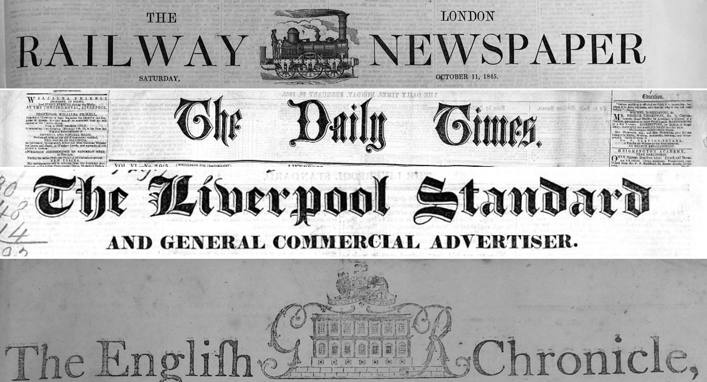
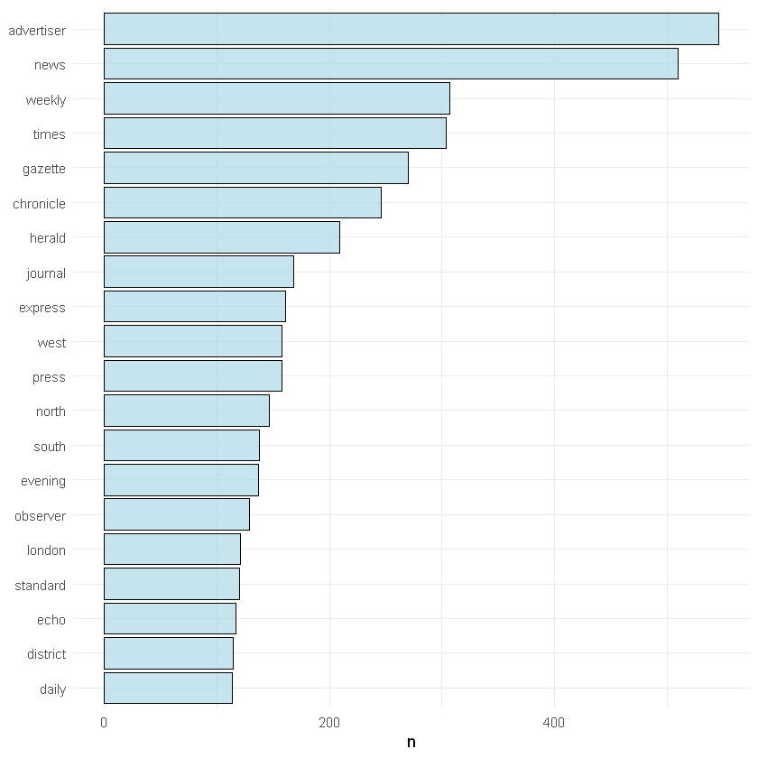

--- 
title: "Demystifying Newspaper Data with R (and a tiny bit of Python)"
author: "Yann Ryan"
date: "`r Sys.Date()`"
site: bookdown::bookdown_site
output: bookdown::gitbook
documentclass: book
bibliography: [r_for_news.bib]
csl: mhra.csl
github-repo: yannryanBL/r-for-news-data
description: "This is a book to help new and existing users find, process and analyse historical newspaper data, using the programming language R, and its IDE R-Studio"
---

# Preface & Acknowledgements

I spent the last year or so working at the British Library as a Curator of Newspaper Data. It was an experimental position, conceived on the premise that the _data_ generated by newspaper digitisation projects, in this case the _Heritage Made Digital_ project, deserves its own curatorial role and set of practices.

It was an exciting time to work on such a project while 'big data' analysis using newspaper content, by historians, is no longer in its infancy, it is firmly in a soul-searching adolescence, and it's been exciting working on an evolving discipline, one which is developing its own set of practices, understanding where and how its bias works and the implications this might have, and generally moving from a sense of naive optimism to a practice which is more academically and mathematically rigorous and self-reflective. 

The British Library was a wonderful, inspiring place to work, and over the year I spent a lot of time getting to grips with the extent and wonderful complications involved in getting access to and analysing the data that the Library has (and elsewhere). This book, then, is meant as something of a roadmap - we are not quite at the final stage of the journey but great steps forward have been taken. The only way I know how to get there is through a programming language, and specific examples.

This book is based on my experiences in this position, as well as some from my own PhD work. It's conceived as somewhere between a 'how-to' and an inspirational (or aspirational) piece of writing intending to survey and encourage the use of newspaper data. It does not cover everything, partially because of my own shortcomings and partially because newspaper data is a vast, incomprehensible and ever-expanding field. I am grateful to those who have taken the time to clear the dense thickets (or perhaps sweeping for mines is a more suitable metaphor, given the risks of failure), including Ryan Cordell, Jo Guldi, Bob Nicholson and Paul Fyfe.

I owe a huge debt of gratitude to the Library, and in particular the Lead Curator of News and Moving Image, Luke McKernan, for his help and support during my time, as well as the rest of the News Collections Team, Beth and Stephen, the Digital Scholarship team, and the wonderful team working on the _Living with Machines_ project. 

This is a book about how to find, download and use this newspaper data. It has been written, in part, by an employee who worked at the British Library, but it does not represent the Library's views in anyway. This is a record of my experience rather than any official information or advice - policies may change, and although I hope to update the book when that happens, I can't guarantee that the information here will be up to date. 

<!--chapter:end:index.Rmd-->

# Introduction

## Unlocking the past with newspaper data

Write an example here. Start with metadata, find a bunch of newspapers you're interested in. From this make a corpus. Map, plot, text mine, make an interactive visualisation. Understand patterns of text reuse, or use relative frequencies of keywords to see when they were emphasised.

The historian now has a lot of newspaper data at her disposal. She might 

She goes online, is interested in the reception of news about the Crimean War in Manchester. But where to start? Well, first she narrows down the list of newspapers to consult using an interactive map. For this research, she'll look at everything published in Manchester between 1853 and 1857. But also, she's interested in a more fine-grained group of titles: this will specifically be a study of the established press: so those that lasted a long time, at least fifty years in total. And while she's at it, she'll specify that she's only interested in the Liberal press, using an enriched database of political leanings.

List of titles in hand, she goes the BL Open Repository and finds the openly accessible ones, and downloads the relevant files, in .xml format. From here she extracts the text, article by article, into a single corpus. She makes a list of search terms which she thinks will help to narrow things down, and, using this, restricts her new corpus to articles about the Crimean war, as best as possible. 

First she looks at the most frequent terms: the usual suspects are there, of course - but once she filters out the 'stop words' she sees some potentially patterns, and notes down some words to dig into later. Giving the top ten per month is also interesting, and shows a shift from words relating to the diplomacy of the conflict, to more potentially more 'emotive' language, describing individual battles. 

Next she creates a 20 topic model to see if there is any difference between the types of articles in her corpus, which shows a few 'themes' under which the articles can be grouped together: one with words like _steamer_, _navy_, _Sebastopol_ as its most important words is an unusual grouping, and might be worth exploring. 

Using sentiment analysis the historian of the Crimean war notices a shift towards reporting with more negative words, and a cluster of particularly negative articles in late 1854: when the reports of the failed military action during the Battle of Baklava started to trickle through: an event which was immortalised only weeks later in Tennyson's narrative poem _The Charge of the Light Brigade_. Not surprising, perhaps, but a reassuring confirmation.

How were these titles sharing information? Using techniques to find overlapping shared text across multiple documents, she works out that the flow of information moved from the established dailies to the weekly titles. 

This is not too far into the future: we're starting to make data openly available. The tools, which only a few years ago were restricted to experts, are now unimaginably easier to use. 

Things have moved on from the first generation of 'how-to' guides for digital humanities students: it's now fairly reasonable to pick a language, probably R or Python, and do all analysis, writing, documentation and so forth without ever leaving the safety of its ecosystem. These modern languages have a huge number of packages for doing all sorts of interesting analysis of text, and even authoring entire books.

On the other hand, the promise of scraping the web for open data, while still with its place, has in many ways been superseded. The historian looking to use newspaper data must wrestle with closed systems, proprietary formats and so forth. The sheer quantity of newspaper data, and its commercial roots (and perhaps new commercial future), mean that it has not been treated in the same way as many other historical datasets. Newspaper data has, up until recently, had several financial, legal, bureaucratic and technical hurdles. 

The promise of newspaper data is great, but the practicalities are complex, and can be offputting for the non-specialist. This book hopes to simplify some of these techniques, demystify the formats, and provide a way in for those who would like to dip their toe in the waters of newspaper data. 

## What is newspaper data?

Difference between content and data? It's arbitrary, all of the digitised content could be considered data. Perhaps it takes on that name when we do certain acts on it? For example the images become data 

Get a nice image for here <could use southern right whale image?>

## Why is it useful?

There is a _lot_ of newspaper data available now for historical researchers. Across the globe, Heritage Organisations are digitising their collections. Most news digitisation projects do OCR and zoning, meaning that the digitised images are processed so that the text is machine readable, and then divided into articles. It's far from perfect - we'll show some examples in a later chapter - but it does generate a large amount of data: both the digitised images, and the underlying text and information about the structure.  Once you get hold of this data, the rewards can be huge: looking just at English-language users in the last few years, researchers have used it to understand Victorian jokes, trace the movement of information and ideas, understand the effects of industrialisation, track the meetings of radical groups, and of course understand more about the newspapers themselves and the print culture that surrounds them.

While there has been a lot digitised, their is much, much more still to be done. The collection, in any country, is far from representative. But we must work with what we've got. The new histories of the press will be written by looking at text at scale, drawing broad conclusions, understanding genre, authorship and so forth through data analysis. 

We're just at the beginning: in the last few years projects have been using neural networks methods to improve the kinds of things we can do: the Living with machines project, for example, or several projects at the Royal Library in the Netherlands. The methods I describe here are simplistic, but they can still add to our understanding. 

[//]: # Change these out for real plots, using title list and shapefile - need to make a UK-Ireland shapefile!

[//] # Data - adds to statistics, gives another point of view. Another way of thinking about historical fact?

[//] # 

```{r echo=FALSE, fig.show = "hold", out.width = "50%", fig.cap="The portion of British Library Digitised Newspaper Content, and the physical collection, mapped", message=FALSE, warning=FALSE, fig.align = "default"}
knitr::include_graphics(c("images/online-circles.png", "images/title_holdings.png"))                      
```

## Short history of newspapers, newspaper digitisation?

### Burney and EEBO? 

[//]: # (check order)

### JISC 1
### JISC 2
### BNA

## Goals
Hopefully, by the end of this book, you will have:

* Know what newspaper data is available, in what format, across a variety of countries and languages.
* Understand something of the various XML formats which make up most newspaper data sources
* Have been introduced to a number of tools which are particularly useful for large-scale text mining of huge corpora: n-gram counters, topic modelling, text re-use. Including some specific to news, such as the R library _Newsflow_.
* Understand how the tools can be used to answer some basic historical questions (whether they provide answers, I'll leave for the reader and historian to decide)

Historians have used newspaper data to do x and y.[@Hills:2019aa] Newspapers have long been thought of as a proxy for public opinion, a historical source or 'first draft of history', used to study the movement and genesis of knowledge and information, help to understand the mix of private and public, how power can be advanced through news, and so forth. Information, and access to it, was key to understanding the movements and processes that shaped early modern and Victorian society. Understanding newspapers at scale can help with that.

ome people might not even be interested in the news in its own right: how it was created, distributed, shaped, what the political pressures were, how it was read at different times, and how it came to shape those who read it.

What do you need in advance?
Probably a mix of coding skills etc. 

## Format of the book - bookdown and github
Will try and explain as much as possible, but will take shortcuts
Not a programming expert, so it may not be optimised, the best of way doing things. It's just the way I've found that works for me.
Part of the reason for doing this is because writing in bookdown and GitHub is quite geeky fun. I will unashamedly do things because I _can_, on occasion.   

Bookdown allows for code and figures directly in the text. I'll make a very simple dataframe and plot it.

First load a couple of packages:

```{r message=FALSE, warning=FALSE}
library(ggplot2)
library(dplyr)
```

Make a dataframe:

```{r}
a <- c(10,20,30,40)
b <- c('book', 'pen', 'textbook', 'pencil_case')
c <- c(TRUE,FALSE,TRUE,FALSE)
d <- c(2.5, 8, 10, 7)
df <- data.frame(a,b,c,d)
```

Plot it:

```{r fig.cap="plotting example"}
df %>% ggplot() + geom_point(aes(x = a, y = d, color = b), size = 5)
```


There are bits of Python throughout, where I've only managed to work something out using that language. This is done using ```Reticulate```, which allows for Python within R markdown. I hope I'll be able to revise at some stage and do everything through one language.

How did I write the book? In R-studio, bookdown and bibdesk
There are a million things I could and would like to explain detail.

There are a couple of things you'll need in order to build a copy of the book yourself. This may not be important to you. One thing that needs to be done is entering a bing API key for the relevant chapter. The book won't complete without this. 

## Why R?
This is a book made _with_ R, and _using_ R, but it is not really _about_ R. I wanted to show some techniques. It should be readable by anyone, but it's possible bits will not be so easy to follow.
Used to be idiosyncratic, is becoming very widely used by data scientist, digital humanities, social scientists. 
A lot of this is because of developers like Hadley Wickham and R studio - the tidyverse, but also data.table.

CRAN, packages and environments much easier to use. I'll never be a full-time coder, so not worried in learning a 'proper' language. R works. 

Have a look at the list http://dh-r.lincolnmullen.com here, and also Hadley Wickham's R for data science.

[Why I use R](https://blog.shotwell.ca/posts/why_i_use_r/)

### Who uses R?

### The Tidyverse

Historians using the language: Sharon Howard, work on criminal tattoos. Bruno Rodrigues

Writing a book with such a specific goal is a bit of a weird proposition

## Who is the book for?
Historians looking to understand news at scale. Undergraduates and postgrads looking to dip their feet into computational methods.

Imagine a PhD student, hasn't used newspaper data before. What is available? How can she access it? Does she need to visit the library, or will she be happy with what's available online? 

## Format of the book

The rest of this book is divided into three sections: 
* Data, which goes through the availability of various news datasets, for the moment with a heavy emphasis on the UK
* Methods, which talks through some of the techniques in a broad sense
* Examples, which uses the techniques above to actually do some stuff - these are like mini research projects, intending to show how R can help with newspapers and also show something interesting. 

The book doesn't need to be read in its entirety: if you're just interested in finding newspaper data, specifically that collected by the British Library, you could stick with the first part. You might be a much better programmer than me and just interested in the scope of the Library's datasets for some analysis - for instance, it might be useful to look at the chapters on the BNA and JISC digitisation projects, to get a handle on how representative the data you have is. You might have arrived at the Library to do some research and not know where to begin with our folder structure and so forth. As much of that information as possible has been included.


<!--chapter:end:01-intro.Rmd-->

# How to use this book

## What is this?
This might look like a static book but in fact it's a living, breathing document. It's actually written using a programming language. The language is called R. It's an open source language that was originally used for very specifically statistics-heavy work, but it's become much more general in the last few years. Part of this is in thanks to R-Studio, which is an IDE for R. This book is written in R-studio using a language called R markdown. This is a way of writing and formatting text like a word processor, except you use code to specify what you want and the program decides how it should look and renders it, rather than moving around the elements you see on front of you. All the plots you see are not images, but rather real bits of code, which run every time the book is rendered, and produce the relevant plots or tables. It means that all the code you type _has_ to work, otherwise the book can't render. That's a pretty sweet way of making sure everything is correct!

You can just read this book as is, but you can also play around with it, change the code and make your own copy, simply by downloading R-Studio and a bunch of packages to go along with it. You'll also see that with a little bit more work, you can clone a copy and make changes, which can then be _suggested_ as changes for this version, or just kept in your copy. 

## Make changes directly to the markdown files on Github. 

You don't actually need to download and use R-Studio to make changes to the book, but it does of course limit you to simply changing the text. You can simply register an account on [Github](Github.com) go to the [Github page](https://github.com/yannryanBL/r-for-news-data). You'll see a list of files. The '.Rmd' files contain the markdown which builds the book. Here you can click edit, and change whatever you want. It will create a copy for, known as a 'branch', and you can keep working away on it, or you can submit a pull request. If this is approved, it will then get added to the master branch, and be added to the 'live' version of the book. It probably works best for small changes like typographical errors, but I guess you could write code as long as it all worked.

## Download a copy
This book lives on a public repository on GitHub. That means that it can be downloaded and potentially changed by anyone. You can download a copy of all the files that make up this book, which includes code, figures, pictures, a bibliography file and some other bits. 

It's pretty easy to download, you don't even need a github account. Navigate to [Github page](https://github.com/yannryanBL/r-for-news-data). On the top right-hand corner there's a big green button which says 'clone or download' Clicking on this gives a URL, which can be used with git on your computer to properly download the repository. You can also download the whole things as a zip, unzip it and start a new project in R-studio. 

## Download R and R-Studio
The first thing you'll need is R and R-studio. They are separate things, which might seem confusing or really obvious, depending on your exposure to programming languages. R is the main software. You could actually just download this and run it with a command prompt and a text editor, if you wanted to. R-Studio is an interface to the language, which makes it much easier to use, and adds lots of extra features. 

This bit is pretty simple. You download the latest version of R, install it, and then download R-studio and install that. 

R-Studio has four main windows, each with a number of tabs. The top left is where you write code, and view the dataframes you've created or imported. The top right contains your environment, which is a list of all your dataframes, variables and functions and other bits (and also some extra tabs once we've installed some more packages). The bottom right is a list of files in your project's directory. 

Now you can open it in R-Studio. 

## Licence terms
It's released under a CC-0 licence. This means you can use it for whatever purpose you like, including commercial. More details about creative commons licences are here: 

## Clone a copy to GitHub
There's another way to get the book into github, one which allows you to make and suggest changes much more efficiently, though it takes some preparation to get up and running first. You need to install git to your computer, sign in, and then start a new project, this time clicking 'Version Control', then click on the 'git' option, and then copy and paste the URL of the repository into the first box. When this works, you'll automatically download all the files from github. There's a lot to github, but basically, if you 'pull', you get the latest version from the repository, if you 'commit' then 'push', you push to the repository. You 'push' to your own branch: it's only by submitting a 'pull request' that your version will get considered and merged with the master. 

If you want to contribute to the book, you'll probably be at a stage where you can do this. 

## Make your own version

If you want, you can just make a 'branch' and never have the intention of having it merge. You could change the name, rip out bits, redo all the code and so forth. 

<!--chapter:end:02-how_to_use.Rmd-->

# (PART) Part I: Sources and data {-}

# Newspaper data - international

Most countries have digitised all or part of their newspaper collection. Digitised newspapers are a form of 'soft power' or an item of cultural pride. These newspapers, unfortunately, exist in national silos, using different formats, with different levels of access. There's not much to do about that except try and understand the different ways which content has been digitised. Several projects are currently doing pan-national things, including Impresso, and Europeana, but the majority, by far, is not serachable across nations. 

In addition, the level and method of access varies widely. Some countries (Australia's _Trove_ and the U.S's _Chronicling America_ project) provide API access. Others allow for bulk downloads of the XML. Others have free access to all out-of-copyright material, and then allow bulk downloads on request, or through collaboration (such as the KB Library in the Netherlands). Other countries (notably the UK) partner with commercial companies to provide access, including free access on the Library's site. 

The data, too, comes in many different forms. Most digitised newspapers are processed with OCR software to create machine readable text. This processing usually results in data in XML format, specifying some information about the content. This will definitely include metadata about the newspaper, information on the software used and the owner of the data, and might include information on the the way the page is laid out, and information on how each article has been segmented. Each software will have a different way of processing the data, and a different output. This will also change as software gets updated. For example, the XML output of the JISC titles includes a different XML file for each article. On the other hand, the newer digitised content from FMP contains an XML file for each page, and a METS file which specifies how the articles can be recreated. This will be outlined in some more detail in a further chapter, but it's best to think of it as an ongoing, flexible format. We'll explain how to work with some of them but each will be different.

Worth noting - most countries do most of their digitisation from microfilm, for reasons of speed and cost. It's worth bearing in mind - digitised collections are very heavily influenced by the microfilm policies that went before them. 

Sources

Lancaster Newsbooks
Burney Collection
EEBO
EEBO TCP (pamphlets)
BNA
HMD newspapers
JISC through GALE

## UK

### British newspaper archive

The British Newspaper Archive is a partnership between FindMyPast and the British Library, digitising newspaper pages from the BL's collections. The process is ongoing, digitising from microfilm and originals. Pages are segmented and OCRd, and can be full text searched. It is a commercial site and a fee is charged to access content away from BL reading rooms. Material from HMD newspaper digitisation project will most likely be added to the site. 

Added 6 million pages last year

https://www.britishnewspaperarchive.co.uk/

28 million pages

450,000,000 (total physical collection)

Access rights	
Free within the BL reading rooms, paid subscription off-site

Features	
Download individual pages; OCR; segmentation; search; browse

Example projects
Content analysis of 150 years of British Periodicals; Victorian Meme Machine; Protest and the politics of space and place; Frederick Douglas in Britain; Scissors & Paste; Oceanic Exchanges

## Outside UK:

### Chronicling America
Library of Congress
U.S

Chronicling America is a Library of Congress initiative providing access to historic newspapers. Grants were given to participants to digitise approximately 100,000 newspaper pages each, which should represent "history, geographic coverage and events of note". Mostly from microfilm for speed and cost. PDFs are available for download, full text search.  CA has an API which allows for the creation of third party applications and sites using the bulk data. Good search functions but difficult to browse by date/region. More information here: https://oceanicexchanges.org/2018-10-17-data-reports-ca/

Between 1 - 2 million over the past 5 years, 3.3 million pages expected this year.

https://chroniclingamerica.loc.gov/

https://chroniclingamerica.loc.gov/about/api/

14 million pages

 (probably impossible to find total as it is a collection of individual State projects)

JPEG2000 and PDF for download

Free - no key needed for API

OCR; segmentation; full text download; search; API

Data Visualization: Journalism’s Journey West; An Epidemiology of Information: Data Mining the 1918 Influenza Epidemic; Bookworm; American Lynching; America's Public Bible; Historical Agricultural News; Chronicling Hoosier; US News Map

### Delpher
Koninkklijke Bibliotheek
Netherlands

Delpher is the Netherland's national media archive database. It contains 11 million pages of newpapers. It has certain datasets available for bulk download. The front page interface is clean and allows for very quick browsing by date. There is also an associated site labs.kb.nl which hosts datasets and projects.  The bulk download has both XML and plain text files, but not images. The site contains 1.5 million newspapers or 11 million pages, representing 15% of all newspapers published. Some external news sources are searchable through Delpher, with the link going through to the external site. 

130 titles to be digitised between 2018 - 2021. About 50,000 newspapers (issues) added in 2018.

https://www.delpher.nl/nl/kranten

Full dataset here: https://www.delpher.nl/nl/platform/pages/helpitems?nid=513&scrollitem=true; derived datasets here: http://lab.kb.nl/datasets?f%5B0%5D=field_product_type%3A1

11 million pages (15% of total) 1.4 million newspapers from national library plus 2.9 million external newspapers. 

73,333,333 pages

Funding from Metamorfoze - Netherlands national programme for the preservation of paper heritage. https://www.metamorfoze.nl/english

No images in bulk download. Individual pages can be downloaded as text, JPEG, PDF.

Free access, bulk download until 1876

OCR; segmentation; browse by date; search; bulk download of everything up to 1876; cut clippings and download text or image

Siamese; Frame Generator; Dictionary Viewer; Narralyzer; Genre classifier

### Eluxemburgensia
Bibliothéque Nationale de Luxembourg
Luxembourg

Luxemburg's open data sets, currently the only one released is a historical newspaper dataset. Contains a series of 'packages', made to look like different versions of a web product or software, with very clear uses for each. XML/ALTO files. Link to a tool which extracts data from the XML, available on GitHub. Segmented and OCRd. 

15 - 20k pages per month at peak - carried out by external provider

http://www.eluxemburgensia.lu/R/RN=422843522&local_base=SERIALS. 

http://data.bnl.lu/data/historical-newspapers/

650,000 pages, 12% of total

5.4 million

Government funded - through National Library/Ministry of Culture

XML/ALTO and PDF, full text and TIFF images

Free access to bulk downloads, free access to PDF downloads.

OCR; search; segmentation; full text; XML download; bulk download

Brodigues blog uses

### Europeana
Europeana Consortium (funded by the European Union)
Europe

Newspapers; images; art; manuscripts; maps; music; others

Europeana is an aggregator for many of Europe's national newspaper collections, containing 4,129,989 newspapers (issues, presumably, rather than pages). Some are image or full text and other records are metadata only. 876,724 have had OCR processing. Newpapers can be browsed by date, country and title. Can be filtered by rights, which is useful. Images can be downloaded but users are directed back to the original source for more features. The plan is to tag up to 10 million pages with metadata and named entities. 

Difficult to tell - about 1,000 additional records tagged 'newspaper' were added in 2018.

Currently available through http://www.theeuropeanlibrary.org/tel4/newspapers also https://www.europeana.eu/portal/en/collections/newspapers as part of the wider Europeana site.

4129989 newspapers

Funding: European Union

Multiple sources with different restrictions

OCR; search; segmentation; bulk data download; metadata

### Finnish Newspaper Database
National Library of Finland
Finland

Newspapers; journals; maps; ephemera

Finland's national newspaper digitisation, run by the National Library of Finland.  7 million pages, 4 million of which are free to use and out of copyright. Some extensive tools for users: can download full text, PDF or XML of all pages. Have been OCRd and everything is also available on Europeana. Can be browsed by year and title. There's also bulk data download available, multiple packages.

Digitising at 1 million pages per year according to https://oceanicexchanges.org/2018-02-20-data-reports-finland/

https://digi.kansalliskirjasto.fi/etusivu

https://digi.kansalliskirjasto.fi/opendata/submit

6.4 million newspaper pages: all material up to 1929 plus more. 

6.4 million pages
PDF download

Free & open until 1929, restrictions thereafter (approx 4 million pages free access). Bulk downloads are available, N-Gram list and other data packages. 

OCR; search; segmentation; full text; XML download for individual pages; bulk data download

"Finnish text reuse (http://comhis.fi/clusters); Local Letters to Newspapers; Geography of the nineteenth-century “lingonberry rush”
"

### Gallica
Bibliothéque Nationale de France
France

Newspapers; books; manuscripts; images; music sheets; sounds; objects

France's national newspaper digitisation site, part of their larger digital library of BnF. Intended to have 3.5 million pages, over 30 titles, free of charge. Contains useful search functions, containing snippets of the newspaper image where the term is found. Full text and PDF downloads are available. There's also some interprative essays on the site, and the newspapers can be browsed by theme. Searches for certain themes or topics result in a 'Gallica advises' section above the search results with (presumably curated) information. Can be browsed by region, both region published and region covered. 

https://gallica.bnf.fr/html/und/presse-et-revues/les-principaux-quotidiens

2.3 million images/pages
PDF, JPEG
Free and open for early material
OCR; search; browse by date; browse by region; 

### Trove
National Library of Australia
Australia

Newspapers; Govt. Gazettes; Journals & datasets; books; pictures & photos; sound, music & video; diaries & letters; websites; people

Trove is an online database of resources relating to Australia, including newspapers and other material. It is a centralised repository for material from a large number of suppliers, including 221,289,583 newspaper articles. Trove has a very effective and useful API and is used by lots of external researchers as well as for commerical use. The metadata about resources is processed for searching via the website and API, but Trove actually hosts the newspaper content themselves. They also have user tools such as making corrections, tagging etc with a substantial volunteer community making changes. More information here: https://oceanicexchanges.org/2018-05-29-data-reports-trove/

400,000 pages in the past financial year.

https://trove.nla.gov.au/newspaper/

http://help.nla.gov.au/trove/building-with-trove/api

24 million pages

3,800 titles pre-1955. 1,500 of these have been digitised. 

Funded by National Library but also State and local libraries sometimes pay to have their material digitised/uploaded
PDF download

Free, open API. Material is mostly pre-1955 and therefore can be digitised without copyright agreement. Some post-1955 material with agreement from the publishers.

OCR; segmentation; search;browse by date; API; metadata

Drifter; Culture collage; Eyes on the Past; The Front Page; Trove Zone Explorer

### Papers Past
National Library of New Zealand
New Zealand

Newspapers; magazines & journals; Letters & Diaries; Parliamentary papers

Papers Past is New Zealand's digitised document resource. It has four sections: Newspapers, Magazines & Journals, Letters & Diaries and Parliamentary Papers. The Newspaper collection is a selection of digitised NZ and Pacific newspapers, including early te reo Maori ones. Content is searchable, and it is possible to browse by date, title or region. Each title has a mini-history on the site. No indication of how much material has been digitised as a percentage of total. Particularly high-quality scans and accurate OCR/segmentation.

350-400k pages per year

https://paperspast.natlib.govt.nz/newspapers

Supplied on case-by-case basis

40% available through digitalnz.org API

5.4 million pages

Free open access. Images and text can be printed. Assumption that anything over 100 years is out of copyright. 

OCR; segmentation; search;browse by date

###  Hemeroteca Nacional Digital de Mexico 

(1735–1969)	This is the national newspaper collection of Mexico. Titles from 1722 - 2010, with restrictions on newer content. Has full-text search but doesn't seem to have access to full text download. Restrictions on PDF downloads. Some basic visualisations and information on the most consulted titles. 

http://www.hndm.unam.mx/index.php/es/

###  Belgica Press

This is Belgium's national newspaper digitisation project. 4 million pages have been digitised, from 1831 to 1950, for a select number of titles (L’Echo De La Presse, Gazet Van Brussel, Het Handelsblad, L’Indépendance Belge (printed in Britain), Le Messager De Gand, De Nieuwe Gids, De Nieuwe Standaard and Het Nieuws Van Den Dag). Up to 1919 is freely available online. Seems to have full text search but not download, and no easy way to download full images. 

https://www.belgicapress.be/

4.2 million pages, 1.2 million available externaly (rest within library)

Restrictions on PDF download and full text versions, material after 1919. 

OCR; search; browse by date

###  Welsh Newspaper Archive
To fill in - have a large collection

###  National Library of Scotland

###  Italian newspapers
Doesn't seem to be any centralised repository, but various archives are available through the websites of individual newspapers. 

###  Hemeroteca Digital (Spain)

###  ANNO - Austrian Newspapers Online
Anno is Austria's national digital newspaper collection. It contains 500 titles, over 10 million pages, from the 16th century to the 1940s. They are mostly OCRd and can be full-text searched. The site can be browsed by title or date, through a calendar. 

###  BC Historical Newspapers
The BC Historical Newspapers project features digitized versions of historical papers from around the province. The titles, which range from the Abbotsford Post to the Ymir Mirror, date from 1859 to 1995. Has some pretty advanced browse and search features, and can download PDFs, full text and metadata files. 
https://open.library.ubc.ca/collections/bcnewspapers

OCR; full text download; metadata download; browse by date, title

###  Media Stream
Media Stream is Denmark's web access for the Royal Library's newspaper, radio and television commercials. 35 million pages of newspapers have been digitised, access to anything after January 1919 is available only in the library itself. The archive has full-text search, but seemingly no way to access the full text of individual articles. Pre 1919 material can be downloaded as PDFs. There's also a link to a tutorial on how to search. 

http://www2.statsbiblioteket.dk/mediestream/avis

35000000 pages
PDF, free to 1919
OCR; browse by title

###  Stare hrvatske novine
Croatia's national digitised newspapers. Select papers starting from 1789. Limited functionality. 

###  ZEFYS
Access to holdings in the Staatsbibliothek Berlin and other German newspapers and German newspapers abroad. 276,015 copies of 193 newspapers. Mixed functionality, some are OCRd, others just images. Has a 'year cloud' for browsing by year, which also illustrates quickly which years have most quantity of news. Seems to run just from 1890 to 1939. 

http://zefys.staatsbibliothek-berlin.de/index.php?id=start

###  Timarit.is
Newspaper archive for Iceland, Greenland and Faroe Islands. Currently contains 1179 titles, 64683 articles, 5619584 pages (presumably the articles are low because it's only counting ones that have been segmented successfully). Full text search is available, as is full text and PDF downloads. Can be browsed by titles. Some early titles possibly manuscript. 

http://timarit.is/listing_init.jsp?lang=en

5619584 pages
PDF
FREE
OCR (limited); full text search; browse by title

###  Google news archive

Google news archive originally started as a standalone product but now is incorporated into Google News. Mixture of titles available for searching, but has not been updated since 2011. Significantly has a full archive of the NYT. OCRd, but the text is not browsable or downloadable. Can browse by title or search. Perhaps more functionality on various Google news apps

https://news.google.com/newspapers

###  Baltic Digital Library
Collection of digital objects, including newspapers. Some interesting features including structure (essentially allowing for browsing through titles/issues. 

###  NewspaperSG
Singapore's national newspaper collection. Newspapers from 1831 onwards, plus a catelogue of the National Library's microfilm holdings. Interesting 'search terms visualiser', essentially an N-Gram timeline, with up to five words at a time. Gives actual numbers rather than relative frequency, which isn't very helpful if the material is not evenly spread out over the time. Also 'this week in history' and 'most viewed articles' sections. Search brings up OCR text first, rather than images. Cannot download full files 

### Svenska dagstidningar
Partial Swedish Newspaper archive, containing over 500 titles, from 1645 to the present day. Material up until 1903 is freely available, anything after that only in the reading rooms of various Swedish libraries. 

https://tidningar.kb.se/

500 titles

### Handwritten Newspapers Project
Archive of handwritten news from around the world. First issue is from 1700. Browsable by date. Some images but mostly links or catelogue records

https://handwrittennews.com/

### The Medici Archive Project
The Medici archive project consists of two parts: Building Interaction Archives (BIA) allows for the querying of manuscript documents, including handwritten news (avvisi). Some have full text transcriptions or English synopses. Documents can be compared via split screen, and there is some ability to browse or search named entities. The Medici Interactive Archive (MIA) is the second part, which intends to make the whole Medici archive available to researchers, including the ability to edit transcriptions, for example.  
http://www.medici.org/


<!--chapter:end:03-sources-int.Rmd-->

# UK Newspaper Data

## What access do you need?

### Want to find individual articles.
Access through the BNA or Gale data, depending on access. BNA if you need the most coverage, and are interested particularly in local or regional titles. Gale has better search facilities but less content. 
### Want to do some simple text mining, not so bothered about regional coverage
Probably access HMD titles through the repository

### Want to do text mining on a large corpus
Request access to the Library's newspapers through BL labs or elsewhere. Get access to raw files. Do you own analysis or else follow steps here to extract the data. There's instructions for JISC and HMD titles. 

### Want to do text mining on the entire digitised collection
You'll need to speak to FMP, who run the British Newspaper Archive. They do take requests for access. There is a dataset of n-grams which has been used for text mining, sentiment analysis etc. and might be useful, though the collection has grown significantly since this point. 

### Want to do something involving the images, such as computer vision techniques, 
You'll probably need to request access to newspapers through the British Library, or through Gale. Gale will send a copy of the JISC 1 & 2 data (with OCR enhancements) on a hard drive to researchers, for a fee. Access through the Library will allow for image analysis but might be difficult to take away. The images up to 1878 are cleared for reuse.

## Intro to British Library Newspapers
>Systematic collection of newspapers at the British Museum (the precursor of the British Library) did not really begin until 1822. At that time publishers were obliged to supply copies of their newspapers to the Stamp Office so that they could be taxed. In 1822 it was agreed that these copies would be passed to the British Museum after a period of three years. From 1869 onwards newspapers were included in the legal deposit legislation and were then deposited directly at the British Museum. This systematic application of legal deposit requirements means that many thousands of complete runs of newspapers have accumulated. The majority of newspapers collected are those published since 1800.[@ed-king-gale]

More history of newspapers links and books etc. 

```{r}
knitr::include_app("https://yannryan.shinyapps.io/BNA-map", 
  height = "1200px")
```


https://melissaterras.files.wordpress.com/2020/01/selectioncriterianewspapers_hauswedell_nyhan_beals_terras_bell-3.pdf

What does this all mean for the data? First of all, it means that only a fraction of what was published has been preserved or collected, and only a fraction of that which has been collected has been digitised. Some very rough numbers. The 'newspaper-year' is a good standard unit. This is all the issues for one title, for one year. Its not perfect, because a newspaper-year of a weekly is worth the same as a newspaper-year for a daily. But it's an easy unit to count. 

```{r}
library(tidyverse)
read_csv('https://tiles-api.britishnewspaperarchive.co.uk/readingroom.csv') %>% tally()

```


There's currently about 40,000 newspaper-years on the British Newspaper Archive. The entire collection of British and Irish Newspapers is probably, at a guess, about 350,000 newspaper-years. 

It's all very well being able to access the _content_, but for the purposes of the kind of things we'd like to do, access to the _data_ is needed. 

Lancaster Newsbook Corpus

## EEBO/TCP

## Burney Collection
54 Andrew Prescott, ‘Searching for Dr. Johnson: The Digitisation of the Burney Newspaper Collection’, in Travelling Chronicles: News and Newspapers from the Early Modern Period to the Eighteenth Century, ed. by Siv Gøril Brandtzæg, Paul Goring, and Christine Watson (Leiden: Brill, 2018), p. 55 

The Burney Collection contains about one million pages, from the very earliest newspapers in the seventeenth century to the beginning of the 19th, collected by Rev. Charles Burney in the 18th century, and purchased by the Library in 1818.[@travelling-chron] It's actually a mixture of both Burney's own collction and stuff inserted since. It was microfilmed in its entirety in the 1970s. As Andrew Prescott has written, 'our use of the digital resource is still profoundly shaped by the technology and limitations of the microfilm set'[@travelling-chron] The collection was imaged in the 90s but because of technological restrictions it wasn't until 2007 when, with Gale, the British Library released the Burney Collection as a digital resource. 

The accuracy of the OCR has been measured, and one report found that the ocr for the Burney newspapers offered character accuracy of 75.6% and word accuracy of 65%.[@travelling-chron]. 


Make a chart of what's available


## JISC Newspaper digitisation projects
Maybe a separate chapter?

Most of the projects in the UK which have used newspaper data have been using the _British Library’s 19th Century Newspapers_ collection. This is an interesting collection of content and worth outlining in some detail. Knowing the sources, geographical makeup and motivation behind the titles in the collection can be really helpful in thinking about what is and is not in the sources. 


```{r include=FALSE}
library(rgeos)
library(rgdal)
library(tidyverse)
library(snakecase)
library(mapdata)
libraryPalette = c("#DA2F65","#FFC82E","#00788B","#CEE055",   "#7E3E98",  "#1E6EB8", "#018074", "#865BE7", "#D44202")

load('data/shp_df_all_uk_1891.dms')
counties = read_csv('data/county_data.csv')
jisc = read_csv('data/jisc.csv')

colnames(counties) = to_snake_case(colnames(counties))

title_list = read_csv('data/BritishAndIrishNewspapersTitleList_20191118.csv')

```


```{r include=FALSE}
geocoded = read_csv('data/geocorrected.csv')
colnames(geocoded) = to_snake_case(colnames(geocoded))
```
```{r include=FALSE}
map = map_data('world')
```
```{r include=FALSE}
library(ggrepel)
```

```{r include=FALSE}
geocoded = read_csv('data/geocorrected.csv')
colnames(geocoded) = to_snake_case(colnames(geocoded))
```

```{r include=FALSE}
map = map_data('world')
```

```{r include=FALSE}
library(ggrepel)
library(snakecase)
libraryPalette = c("#DA2F65","#FFC82E","#00788B","#CEE055",   "#7E3E98",  "#1E6EB8", "#018074", "#865BE7", "#D44202")

```


```{r include=FALSE}
library(data.table)

title_list %>% mutate(title_id = str_pad(title_id, width = 9, pad = '0')) %>% 
  left_join(jisc) %>% filter(!is.na(JISC)) %>% left_join(geocoded)
```

```{r include=FALSE}
title_list_na_rem = title_list %>% 
  mutate(last_date_held = replace(last_date_held, last_date_held == 'Continuing', '2019'))


title_list_na_rem$first_date_held = as.numeric(title_list_na_rem$first_date_held)
title_list_na_rem$last_date_held = as.numeric(title_list_na_rem$last_date_held)

title_list_na_rem = title_list_na_rem %>% filter(!is.na(first_date_held)) %>% filter(!is.na(last_date_held))

long_title_list = setDT(title_list_na_rem)[,.(year=first_date_held:last_date_held),by = eval(colnames(title_list))]
```

```{r jisc-bar, fig.cap="Very approximate chart of JISC titles, assuming that we had complete runs for all. Counted by year rather than number of pages digitised.", echo=FALSE, message=FALSE, warning=FALSE}
long_title_list %>% 
  mutate(title_id = str_pad(title_id, width = 9, pad = '0')) %>% 
  left_join(jisc) %>% 
  filter(!is.na(JISC)) %>% 
  left_join(geocoded) %>% 
  filter(year %in% c(1800:1909)) %>%
  mutate(decade = year-year %%10) %>%
  group_by(decade, JISC) %>% 
  tally() %>% 
  ggplot() + geom_bar(aes(x = decade, y = n, fill = JISC), stat = 'identity', alpha = .8) + 
  theme_minimal() + scale_fill_manual(values = libraryPalette) + theme(legend.title = element_text(family = 'serif'), legend.text = element_text(family = 'serif'), axis.text = element_text(family = 'serif'), axis.title = element_text(family = 'serif'))
```


The JISC newspaper digitisation program began in 2004, when The British Library received two million pounds from the Joint Information Systems Committee (JISC) to complete a newspaper digitisation project. A plan was made to digitise up to two million pages, across 49 titles.[@ed-king-gale] A second phase of the project digitised a further 22 titles.[@shaw-newspapers; @shaw-billion for a good brief overview to the selection process for JISC 1]

The titles cover England, Scotland, Wales and Ireland, and it should be noted that the latter is underrepresented although it was obviously an integral part of the United Kingdom at the time of the publication of these newspapers - something that's often overlooked in projects using the JISC data. They cover about 40 cities \@ref(fig:jisc-points), and are spread across 24 counties within Great Britain \@ref(fig:jisc-map), plus Dublin and Belfast.

>The forty-eight titles chosen represent a very large cross-section of 19th century press and
publishing history. Three principles guided the work of the selection panel: firstly, that
newspapers from all over the UK would be represented in the database; in practice, this
meant selecting a significant regional or city title, from a large number of potential
candidate titles. Secondly, the whole of the nineteenth century would be covered; and
thirdly, that, once a newspaper title was selected, all of the issues available at the British
Library would be digitised. To maximise content, only the last timed edition was
digitised. No variant editions were included. Thirdly, once a newspaper was selected, all
of its run of issue would be digitised.[@ed-king-digi]


Jane Shaw wrote, in 2007: 

>The academic panel made their selection using the following eligibility criteria:

>To ensure that complete runs of newspapers are scanned
>To have the most complete date range, 1800-1900, covered by the titles selected
To have the greatest UK-wide coverage as possible
To include the specialist area of Chartism (many of which are short runs)
To consider the coverage of the title: e.g., the London area; a large urban area (e.g., Birmingham); a larger regional/rural area
To consider the numbers printed - a large circulation
The paper was successful in its time via its sales
To consider the different editions for dailies and weeklies and their importance for article inclusion or exclusion
To consider special content, e.g., the newspaper espoused a certain political viewpoint (radical/conservative)
The paper was influential via its editorials. [@shaw-newspapers]

What's really clear, is that the selection was driven by assumed historical need by the Library's users, plus some practicalities around copyright, microfilm and 

The result was a heavily curated collection, albeit with decent academic rigour and good intentions and like all collections created in this way, it is subject, quite rightly, to a lot of scrutiny by historians. [@Fyfe_2016 for example]

[list the titles]


```{r jisc-points, fig.cap="JISC 1 & 2 titles, by city. Irish titles not plotted", echo=FALSE, message=FALSE, warning=FALSE}
ggplot() + 
  geom_polygon(data = map, aes(x = long, y = lat, group = group), fill = "gray90", color = 'gray20') + coord_fixed(1.6, xlim = c(-10, 2), ylim = c(50,60)) + 
  geom_point(data = title_list %>% 
               mutate(title_id = str_pad(title_id, width = 9, pad = '0')) %>% 
  left_join(jisc) %>% 
    filter(!is.na(JISC)) %>% 
    left_join(geocoded) %>% 
    group_by(wikititle, wikilon, wikilat) %>% tally(), aes(x = as.numeric(wikilon), y = as.numeric(wikilat),size = n), pch = 21, color = 'gray20', alpha = .9, fill = "#DA2F65") + geom_text_repel(data = title_list %>% mutate(title_id = str_pad(title_id, width = 9, pad = '0')) %>% 
  left_join(jisc) %>% 
    filter(!is.na(JISC)) %>% 
    left_join(geocoded) %>% 
    group_by(wikititle, wikilon, wikilat) %>% 
    tally() %>% 
    filter(wikititle !='UNKNOWN'), aes(x = as.numeric(wikilon), y = as.numeric(wikilat), label = paste0(wikititle, " (", n, ")")), size = 2, family = 'serif') + 
  scale_fill_gradient(low = "#DA2F65", high ="#FFC82E",na.value="gray90") + 
  theme_void() + 
  theme(legend.direction = 'horizontal', legend.position = 'bottom', legend.title = element_text(family = 'serif'), legend.text = element_text(family = 'serif')) + 
  guides(size = guide_legend(title = 'Total Titles:'))
```

```{r include=FALSE}
library(data.table)

title_list %>% mutate(title_id = str_pad(title_id, width = 9, pad = '0')) %>% 
  left_join(jisc) %>% filter(!is.na(JISC)) %>% left_join(geocoded)
```

This is all covered in lots of detail elsewhere, including some really interesting critiques of the access and so forth.[@smits_making_2016; @mussell-elemental both include some discussion and critique of the British Library Newspaper Collection] But the overall makeup of it is clear, and this was a very specifically curated collection, though it was also influenced by contingency, in that it used microfilm (sometimes new microfilm). But overall, one might say that the collection has specific historical relevant, and was in ways representative. It does, though, only represent a tiny fraction of the newspaper collection, and by being relevant and restricted to 'important' titles, it does of course miss other voices. For example, much of the Library's collection consists of short runs, and much of it has not been microfilmed, which means it won't have been selected for digitisation. This means that 2019 digitisation selection policies are indirectly _greatly_ influenced by microfilm selection policies of the 70s, 80s, and 90s. Subsequent digitisation projects are trying to rectify these motivations, but again, it's good to keep in mind the 


```{r jisc-map, echo=FALSE, fig.cap="JISC 1 & 2 Digitisation Programmes", message=FALSE, warning=FALSE}
title_list %>% mutate(title_id = str_pad(title_id, width = 9, pad = '0')) %>% 
  left_join(jisc) %>% filter(!is.na(JISC)) %>% 
  left_join(counties) %>% 
  distinct(title_id, .keep_all = TRUE) %>% group_by(county_data) %>% 
  tally() %>% 
  right_join(shp_df_all_uk_1891, by = c("county_data" = 'id')) %>% 
  mutate(n = coalesce(n.x, n.y)) %>% 
  ggplot() + 
  geom_polygon(color = 'black', lwd = .1, aes(x = long, y = lat, fill = n.x, group = group)) + coord_fixed(1) + 
  scale_fill_gradient(low = "#DA2F65", high ="#FFC82E",na.value="gray90") + theme_void() + theme(legend.direction = 'horizontal', legend.position = 'left', legend.title = element_text(family = 'serif'), legend.text = element_text(family = 'serif')) + 
  guides(fill = guide_legend(title = 'Total Titles:'))


```

```{r}
leaflet_list = title_list %>% filter(!is.na(link_to_british_newspaper_archive)) %>% left_join(geocoded) %>% group_by(wikititle, wikilon, wikilat) %>% tally()
```
```{r}
library(leaflet)
```
```{r}
links = title_list %>% left_join(geocoded) %>% group_by(wikititle, wikilon, wikilat) %>%
            filter(!is.na(link_to_british_newspaper_archive)) %>%
            distinct(nid, .keep_all = TRUE) %>%
            summarise(link = paste("<p><a href=",
                                   link_to_british_newspaper_archive,">",
                                   publication_title,"</a>", first_date_held, " - ", last_date_held, "</p>\n", collapse = "\n"))


```

```{r}
leaflet_list = leaflet_list %>% left_join(links) %>% filter(!is.na(link))
```
```{r}
lat <- 53.442788
lng <- -2.244708
zoom <- 5
pal1871 <- colorBin("viridis", domain=leaflet_list$n, bins = c(0,5,10,15,20,25,30,35,Inf))
```

```{r}
popup_sb <- paste0(leaflet_list$wikititle, "\n", "Total unique titles: ", leaflet_list$n)
leaflet_list  = leaflet_list %>% ungroup() %>% mutate(wikilon = as.numeric(wikilon)) %>% mutate(wikilat = as.numeric(wikilat))

popup_sblab <- leaflet_list$link

```

```{r}
leaflet() %>%  
            addTiles(
            ) %>% 
            setView(lat = lat, lng = lng, zoom = zoom)%>% 
            clearShapes() %>% 
            clearControls() %>%
  addCircleMarkers(data = leaflet_list %>% mutate(n = replace(n, wikititle == 'London', 40)),lng = ~wikilon, lat = ~wikilat, weight = 1, #cheat and change London to a smaller number, so it doesn't overlap other points
    radius = ~n*.25 %>% sqrt(), ,
                        fillColor = ~pal1871(n),fillOpacity = 0.7,
                        color = "gray95",popup = ~popup_sblab,
                        popupOptions = popupOptions(maxHeight = 100), label=popup_sb,
                        labelOptions = labelOptions(
                            style = list("font-weight" = "normal", padding = "3px 8px"),
                            textsize = "15px",
                            direction = "auto")
  ) %>%
            addLegend(pal = pal1871, 
                      values = n,
                      opacity = 0.7,
                      position = 'bottomright',
                      title = 'Unique titles:')
```


Currently researchers access this either through Gale, or through the British Library as an external researcher. Many researchers have requested access to the collection through Gale, which they will apparently do in exchange for a fee for the costs of the hard drives and presumably some labour time. The specifics of the XML used, and some code for extracting the data, are available in the following chapter.

Some researchers have also got access to the collection through 

## BRITISH NEWSPAPER ARCHIVE
Most of the British Library's digitised newspaper collection is available on the [British Newspaper Archive](www.britishnewspaperarchive.co.uk) (BNA). The BNA is a commercial product run by a family history company called FindMyPast. FindMyPast is responsible for digitising large amounts of the Library's newspapers, mostly through microfilm. As such, they have a very different focus to the JISC digitisation projects. The BNA is constantly growing, and it already dwarfs the JISC projects by number of pages: the BNA currently hosts about 33 million pages, against the 3 million or so of the two JISC projects \@ref(fig:bna-chart) 

There are several important implications for this. First, most data-driven historical work carried out on newspapers has used the JISC data, rather than the BNA collection, because of relative ease-of-access. It's an important point, as there may be an assumption that this kind of work is generally In addition, as it is a contantly evolving dataset, reproducibility is difficult. There are some exceptions: the Bristol N-Gram and named entity datasets used the FMP data, processing the top phrases and words from about 16 million pages. The collection has doubled in size since then: it's likely that were it to be run again the results would be different. 

This is not only because of volume but also because of the change in focus and digitisation policy. Newspapers are selected for various reasons, but an underlying principle of coverage seems to be important: newspapers are obviously not selected at random, which necessarily results in a changing, evolving idea of bias. 

Include a line chart of all the titles, by year. Explain 1855, and earlier missing issues/titles. Don't go into too much detail as its explained elsewhere.

```{r include=FALSE}
nlp_years = read_csv('https://tiles-api.britishnewspaperarchive.co.uk/readingroom.csv')
nlp_years = nlp_years %>% mutate(year = yyyy)
```

```{r bna-chart, fig.cap="Newspaper-years on the British Newspaper Archive. Includes JISC content above.", echo=FALSE, message=FALSE, warning=FALSE}
long_title_list %>% 
  left_join(nlp_years) %>% 
  filter(!is.na(yyyy)) %>% 
  filter(country_of_publication %in% c('England', 'Ireland', 'Scotland', 'Wales', 'Northern Ireland')) %>%
  mutate(decade = year-year %%10) %>% 
  group_by(country_of_publication, decade) %>% tally() %>% 
  ggplot() + geom_bar(aes(x = decade, y = n, fill = country_of_publication), alpha = .9, stat = 'identity') + theme_minimal() + theme(legend.position = 'bottom') + scale_fill_manual(values = libraryPalette)
```

```{r bna-titles-map, fig.cap = "Titles on the British Newspaper Archive.^[data from https://www.britishnewspaperarchive.co.uk/titles/]", echo=FALSE, message=FALSE, warning=FALSE}
long_title_list %>% mutate(title_id = str_pad(title_id, width = 9, pad = '0')) %>% 
  left_join(nlp_years) %>% 
  filter(!is.na(yyyy)) %>%
  left_join(counties) %>%  
  distinct(title_id, .keep_all = TRUE) %>% group_by(county_data) %>% 
  tally() %>% 
  right_join(shp_df_all_uk_1891, by = c("county_data" = 'id')) %>% 
  mutate(n = coalesce(n.x, n.y)) %>% 
  ggplot() + 
  geom_polygon(color = 'black', lwd = .1, aes(x = long, y = lat, fill = n.x, group = group)) + coord_fixed(1) + 
  scale_fill_gradient(low = "#DA2F65", high ="#FFC82E",na.value="gray90") + theme_void() + theme(legend.direction = 'horizontal', legend.position = 'left') + 
  guides(fill = guide_legend(title = 'Total Titles:'))
```


## GALE
### Getting access to GALE data - experience of others

## HMD data- on repository
### Project goals
The Heritage Made Digital Project is a project within the British Library to digitise 19th century newspapers. It has a specific curatorial focus. It picked titles which are completely out of copyright, which means that they all _finished_ publication before 1879. It also aimed to preserve: because of this, it chose titles which were not on microfilm, and were also in poor or unfit condition. Newspaper volumes in unfit condition cannot be called up by readers: this meant that if a volume is not microfilmed and is in this state, it can't be read by _anyone_. 

The other curatorial goal was to focus on 'national' titles. In practice this meant choosing titles printed in London but without a specific London focus. This might seem like a strange selection policy considering the general view that stuff outside London is neglected, but it sort of makes sense: JISC focused on regional titles, then local, and all the 'big' nationals like the Times or the Manchester Guardian have been digitised but sit behind paywalls within those organisations. This means that a bunch of historically important titles may have fallen through the cracks, and this projects is digitising some of those.^[The term national is debatable, but it's been used to try and distinguish from titles which clearly had a focus on one region. Even this is difficult: regionals would have often had a national focus, and were in any case reprinting many national stories. But their audience would have been primarily in a limited geographical area, unlike a bunch of London-based titles, which were printed and sent out across the country, first by train, then the stories themselves by telegraph.]

The important thing to note is that the is, like JISC, a selection made by historians for preservation and curatorial purposes. Again, it's worth thinking about how this affects the bias. 

The good news is that as these newspapers are deemed out of copyright, the data can be made freely downloadable. Currently the first batch of newspapers, in METS/ALTO format, are available on the British LIbrary's Open Repository. They have a CC-0 licence, which means they can be used for any purpose whatsoever. Much of the data examples in the following chapters will use this data. 

[list HMD titles]
[chart of type of runs, what's been digitised so far]
### What's available
### XML flavour

## Luxembourg data


<!--chapter:end:04-sources-uk.Rmd-->

# Data formats
Folder structure
## XML - different flavours
Try and get some help with this?
## Full-text transcriptions - like the Lancaster Corpus

## CQPWeb newspaper corpora

[//] # Don't forget about this one 


<!--chapter:end:05-data_formats.Rmd-->

# OCR and its problems

## What is OCR?

## What is it like in BL newspapers?
In a word, terrible. Well, it varies a lot, and the truth is, nobody _really_ knows what it's like, because that would involve having large sets of very accurate, manually transcribed newspapers, to compare to the OCR text. Subjectively, we can probably make a few generalisations. 

It gets better as the software gets better, but not particularly quickly, because much of the quality is dependant on things to do with the physical form. 

Digitising from print is much better than from microfilm. But print can still be bad. 

Standard text is much better than non-standard. For example, different fonts, sizes, and so forth.

Advertisements seem to have particularly bad OCR - they are generally not in regular blocks of text, which the OCR software finds difficult, and they often used non-standard characters or fonts to stand out. 

The time dimension is not clear: type probably got better, but it also got smaller, more columns. 

Problems with the physical page have a huge effect: rips, tears, foxing, dark patches and so forth. Many errors are not because of the microfilm, digital image or software, and may not be fixable. 

What does this all mean? Well, it introduces bias, and probably in non-random ways, but in ways that have implications for our work. If things are digitised from a mix of print and microfilm, for example, we might get very different results for the print portion, which might easily be mis-attributed to a historical finding. Perhaps there were twice as many mentions of cheese in the 1850s than in the 1890s? It's probably best to rule out that this is not just because later newspapers had a difficult font, or they were digitised from microfilm instead of print. [@hill-ocr, @Cordell_2017, @Piotrowski_2012, @cordell-ocr, @evershed-ocr]

## What information do we have on OCR?

Can you add anything on difference between JISC and BNA 'confidence scores'? Do a comparison?

Make a sample, evenly spread across years?

### Error rate

The error rate reported by the software is a confidence score. The overall confidence score is an average of all these scores. It's not testing against anything but itself: it could have a high confidence score but be completely wrong - perhaps the computer has a misguided sense of its own accuracy? Or it could be crippled with self-doubt, and report very low scores whilst in fact getting everything correct. 

### Ground truth - testing against transcription

## Impact on analysis
It depends. Broad analysis still seems to work - keyword searches, for example, come up with broadly expected results. It might be more important in finer work, for example Natural Language Processing (NLP). NLP relies on 

[Why You (A Humanist) Should Care About Optical Character Recognition](https://ocr.northeastern.edu/report/)

<!--chapter:end:06-ocr.Rmd-->

# (PART) Part I: Basic data methods {-}

# Methods

## Mapping seventeenth century newsbooks

### Mapping with R

#### What can R do

#### Limitations

### Steps

#### Making a background map

#### Geocoding

#### Drawing points

#### Further customisation

## Network analysis of seventeenth century newsbooks

### Background
 
### Network analysis

### Steps

## Network analysis using NLP and Lancaster newsbooks

### Background

### Sources used

### Steps

### Choropleth maps - nineteenth century


<!--chapter:end:07-methods.Rmd-->

# Quick introduction to R and the tidyverse

The motivation behind this book was to provide a way to access and analyse newspaper data using a programming language that I am familiar with. The reason is simple: you write what you know, and I know R best. With its interface, R-Studio, I think it has the easiest transition from someone used to spreadsheet programs, and you'll realise that most of what you do is filter, sort, count and select columns in a data format called a dataframe. 

## What and why?
I think R and R-Studio have the easiest transition from someone used to Excel, and you'll realise that most of what you do is filter, sort, count and select columns in a data format called a dataframe. 

A dataframe is basically a spreadsheet - it contains rows with observations, and columns with variables. Each row is generally a _thing_, for want of a better word. A thing that wants to be counted, either by summarising it as a more general thing, or turning it into something else and then counting it, or removing some of the things first and then counting the leftovers. For me, thing might be a record of a newspaper title, or a newspaper article (and its text), or it might be a single word.

You can do a lot more interesting tasks with a thing in a dataframe. A thing might be a single polygon, in a huge dataframe of polygons or lines, all of which add up to a map, which we can then count, sort, filter and render as an image or even an interactive.

## Using R

### Base R commands
I don't use them very much, but R does have a bunch of very well-developed commands for doing the sorting, filtering and counting mentioned above. If you want to learn base R, I recommend the following:

It is worth understanding the main types of data that you'll come across, in your environment window. First, you'll have dataframes. These are the spreadsheet-like objects which you'll use in most analyses. They have rows and columns. 

Next are variables. A variable is assigned to a name, and then used for various purposes. 

You'll often hear of an item called a vector. A vector is like a python list, if that means anything to you. A vector can be a single column in a dataframe (spreadsheet), which means they are used very often in R to manipulate data. A vector can have different types: for example, a character vector looks like this ```c("apples", "bananas", "oranges")```

A dataframe is just a bunch of vectors side by side.

A vector is created with the command ```c()```, with each item in the vector placed between the brackets, and followed by a comma. If your vector is a vector of words, the words need to be in inverted commas or quotation marks. 

```{r}

fruit = c("apples", "bananas", "oranges", "apples")
colour = c("green", "yellow", "orange", "red")
amount = c(2,5,10,8)
```

You can create a dataframe using the ```data.frame()``` command. You just need to pass the function each of your vectors, which will become your columns. 

```{r}
fruit_data = data.frame(fruit,colour,amount, stringsAsFactors = FALSE)
```

Notice above that the third column, the amount, has <int> under it instead of <chr>. That's because R is treating it as a number, rather than a character. This means you can add them up and do all sorts of other mathy type things to them. 

All the items in a vector are _coerced_ to the same type. So if you try to make a vector with a combination of numbers and strings, the numbers will be converted to strings. I wouldn't worried _too_ much about that for now.

So for example if you create this vector, the numbers will get converted into strings.
```{r}
fruit = c("apples", 5, "oranges", 3)
fruit
```


Anyway, that's a dataframe. 


## Tidyverse

Most of the work in these notebooks is done using a set of packages developed for R called the 'tidyverse'. These enhance and improve a large range of R functions, with much nice syntax - and they're faster too. It's really a bunch of individual packages for sorting, filtering and plotting data frames. 
They can be divided into a number of diferent categories.

All these functions work in the same way. The first argument is the thing you want to operate on. This is nearly always a data frame. After come other arguments, which are often specific columns, or certain variables you want to do something with. 

You installed the package in the last notebook. Make sure the library is loaded by running the following in an R chunk in a notebook:

```{r message=FALSE, warning=FALSE}
library(tidyverse)
```


Here are a couple of the most important ones

### select(), pull()
```select()``` allows you to select columns. You can use names or numbers to pick the columns, and you can use a ```-``` sign to select everything _but_ a given column.

Using the fruit data frame we created above:
We can select just the fruit and colour columns:

```{r}
select(fruit_data, fruit, colour)
```

Select everything but the colour column:

```{r}
select(fruit_data, -colour)
```

Select the first two columns:

```{r}
select(fruit_data, 1:2)
```

### group_by(), tally(), summarise()

The next group of functions group things together and count them. Sounds boring but you would be amazed by how much of data science just seems to be doing those two things in various combinations. 

```group_by()``` puts rows with the same value in a column of your dataframe into a group. Once they're in a group, you can count them or summarise them by another variable. 

First you need to create a new dataframe with the grouped fruit.

```{r}
grouped_fruit = group_by(fruit_data, fruit)
```

Next we use ```tally()```. This counts all the instances of each fruit group. 

```{r}
tally(grouped_fruit)
```
See? Now the apples are grouped together rather than being two separate rows, and there's a new column called ```n```, which contains the result of the count.

If we specify that we want to count by something else, we can add that in as a 'weight', by adding ```wt =``` as an argument in the function.

```{r}
tally(grouped_fruit, wt = amount)
```

That counts the amounts of each fruit, ignoring the colour. 

### filter()

Another quite obviously useful function. This filters the dataframe based on a condition which you set within the function. The first argument is the data to be filtered. The second is a condition (or multiple condition). The function will return every row where that condition is true.

Just red fruit:

```{r}
filter(fruit_data, colour == 'red')
```

Just fruit with at least 5 pieces:

```{r}
filter(fruit_data, amount >=5)
```

### sort(), arrange(), top_n()

Another useful set of functions, often you want to sort things. The function ```arrange()``` does this very nicely. You specify the data frame, and the variable you would like to sort by. 

```{r}
arrange(fruit_data, amount)
```

Sorting is ascending by default, but you can specify descending using ```desc()```:

```{r}
arrange(fruit_data, desc(amount))
```

If you `sort```arrange()``` by a list of characters, you'll get alphabetical order:

```{r}
arrange(fruit_data, fruit)
```

You can sort by multiple things:

```{r}
arrange(fruit_data, fruit, desc(amount))
```

Notice that now red apples are first.

### left_join(), inner_join(), anti_join()

### Piping

Another great feature of the tidyverse is that you can 'pipe' commands through a bunch of functions. This means that you can do one operate, and pass the result to another operation. The previous dataframe is passed as the first argument of the next function by using the pipe ```%>%``` command. It works like this:

```{r}
fruit_data %>% 
  filter(colour != 'yellow') %>% # remove any yellow colour fruit
  group_by(fruit) %>% # group the fruit by type
  tally(amount) %>% # count each group
  arrange(desc(n)) # arrange in descending order of the count
```

That code block, written in prose: "take fruit data, remove any yellow colour fruit, count the fruits by type and amount, and arrange in descending order of the total"

### Plotting using ggplot()

The tidyverse includes a pretty great plotting library called ggplot2. This can be used by piping your dataframe to a function called ```ggplot()```. The basic idea is that you add your data, then you can add plot elements which are called geoms. Some common ones are ```geom_line()```, ```geom_bar()``` and ```geom_point()```. 

To the geom function you add aesthetics, which is basically telling the function which bits of your data should be responsible for which parts of the visualisation. These are added using ```aes()```. I'll explain a bit more about some of these aesthetics as I go along.

As an example:

Bar chart of different types of fruit (one each of bananas and oranges, two types of apple)

```{r}
fruit_data %>% ggplot() + geom_bar(aes(x = fruit))
```
Counting the total amount of fruit:

```{r}
fruit_data %>% ggplot() + geom_bar(aes(x = fruit, weight = amount))
```

Charting amounts and fruit colours:

```{r}
fruit_data %>% ggplot() + geom_bar(aes(x = fruit, weight = amount, fill = colour)) 
```

And just because it annoys me having random colours, we can map them to the actual colours:

```{r}
fruit_data %>% 
  ggplot() + 
  geom_bar(aes(x = fruit, weight = amount, fill = colour)) + 
  scale_fill_manual(values = c("orange" = "orange", 
                               "green" = "#8db600", 
                               "red" = "#ff0800", 
                               "yellow" = "#ffe135"))
```


### Doing this with newspaper data
Who cares about fruit? Nobody, that's who. We want newspaper data! Let's load a dataset of metadata for all the titles held by the library, and do some counting and sorting. 

Download from here: [British Library Research Repository](https://doi.org/10.23636/1136)

You would need to extract into your project folder first, if you're following along:

```read_csv``` reads the csv from file.

```{r}
title_list = read_csv('BritishAndIrishNewspapersTitleList_20191118.csv')
```

Select some particularly relevant columns:

```{r}
title_list %>% 
  select(publication_title, 
         first_date_held, 
         last_date_held, 
         country_of_publication)
```

Arrange in order of the latest date of publication, and then by the first date of publication:

```{r}
title_list %>% 
  select(publication_title, 
         first_date_held, 
         last_date_held, 
         country_of_publication) %>%
  arrange(desc(last_date_held), first_date_held)
```

Group and count by country of publication:

```{r}
title_list %>% 
  select(publication_title, 
         first_date_held, 
         last_date_held, 
         country_of_publication) %>%
  arrange(desc(last_date_held)) %>% 
  group_by(country_of_publication) %>%
  tally()
```

Arrange again, this time in descending order of number of titles for each country:

```{r}
title_list %>% 
  select(publication_title, 
         first_date_held, 
         last_date_held, 
         country_of_publication) %>%
  arrange(desc(last_date_held)) %>% 
  group_by(country_of_publication) %>%
  tally() %>%
  arrange(desc(n))
```
Filter only those with more than 100 titles:

```{r}
title_list %>% 
  select(publication_title, 
         first_date_held, 
         last_date_held, 
         country_of_publication) %>%
  arrange(desc(last_date_held)) %>% 
  group_by(country_of_publication) %>%
  tally() %>%
  arrange(desc(n)) %>% 
  filter(n>=100)
```

Make a simple bar chart:

```{r}
title_list %>% 
  select(publication_title, 
         first_date_held, 
         last_date_held, 
         country_of_publication) %>%
  arrange(desc(last_date_held)) %>% 
  group_by(country_of_publication) %>%
  tally() %>%
  arrange(desc(n)) %>% 
  filter(n>=100) %>% 
  ggplot() + 
  geom_bar(aes(x = country_of_publication, weight = n))
```

So that's a very quick introduction to R. There's loads of places to learn more. 

[R-studio cheat sheets](https://www.rstudio.com/resources/cheatsheets/)

[The Pirate's Guide to R, a good beginners guide to base R](https://bookdown.org/ndphillips/YaRrr/)

[R for data science, which teaches the tidyverse in detail](https://r4ds.had.co.nz)

[Learn how to make a book like this using Bookdown](https://bookdown.org/yihui/bookdown/introduction.html)

<!--chapter:end:08-using-r-tidyverse.Rmd-->

# Regular expressions

To be written by Bruno

<!--chapter:end:09-regex.Rmd-->

# Charting over time with a curated dataset

## Where to download

## Time

## Barplots

<!--chapter:end:10-charts-newsbooks.Rmd-->

# Network analysis with curated seventeenth-century dataset


<!--chapter:end:11-network-newsbooks.Rmd-->

# Geocode and map newspaper titles
R is also really good for creating maps, both for visualisations and for spatial analysis. 


## Points
Another thing we can do is create a map of all the titles. For this we'll need three things

* A background map of the UK and Ireland

* A count of the total titles for each city

* A list of coordinates for all the cities. This last one is a little trickier than the other two, as I'll explain. Without some manually editing we might end up with some slightly dodgy results. But let's just see where we end up.

### Drawing a background map. `

The plotting library *ggplot2*, which is part of the tidyverse package, contains a function called ``map_data()``` which turns data from the *maps* library. This can then be used to draw a map. First you'll need to install the maps package using ```install.packages()```.

Next load *ggplot2* and the *maps* library

```{r}
library(ggplot2)
library(maps)
```


First we assign a name to the dataframe we'll create with a function called ```map_data()```. ```map_data()``` takes an argument with the name of the map you want to load, in inverted commas. Some of the choices are 'world', 'usa', 'france', 'italy'. We'll use the 'world' map. 

```{r}
worldmap = map_data('world')
```

Take a look at the dataframe we've created:

```{r}
head(worldmap, 20)
```

It's a big table with about 100,000 rows. Each row has a latitude and longitude, and a group. Each region and sub-region in the dataframe has its own group number. We'll use a function ```geom_polygon``` which tells ggplot to draw a polygon (a bunch of connected lines) for each group, and display it.

With the ```aes()```, x tells ggplot2 the longitude of each point, y the latitude, and group makes sure the polygons are grouped together correctly. 

```{r}
ggplot() + geom_polygon(data = worldmap, aes(x = long, y = lat, group = group))
```

Right, it needs a _bit_ of tweaking. First, we only want to plot points in the UK. There's obviously way too much map for this, so the first thing we should do is restrict it to a rectangle which includes those two countries. 

We can do that with ```coord_fixed()```. ```coord_fixed()``` is used to fix the aspect ratio of a coordinate system, but can be used to specify a bounding box by using two of its arguments: ```xlim=``` and ```ylim=```. These each take a vector (a series of numbers) with two items A vector is created using ```c()```. Each item in the vector specifies the limits for that axis. So ```xlim = c(0,10)``` means _restrict the x-axis to 0 and 10_. The axes correspond to the lines of longitude (x) and latitude (y). We'll restrict the x-axis to c(-10, 4) and the y-axis to c(50.3, 60) which should just about cover the UK and Ireland. 


```{r}
ggplot() + geom_polygon(data = worldmap, aes(x = long, y = lat, group = group)) + 
  coord_fixed(xlim = c(-10,3), ylim = c(50.3, 59))
```


You can also change the ratio of the coordinates using ```coord_fixed()```. The default is 1, but by specifying a different one with the argument ```ratio =```, that can be changed. Using ```ratio = 1.3``` results in a less squashed-looking map. 


```{r}
ggplot() + 
  geom_polygon(data = worldmap, aes(x = long, y = lat, group = group)) + 
  coord_fixed(ratio = 1.3, xlim = c(-10,3), ylim = c(50, 59))
```

A couple more things, which I'll run through quickly.

We can specify fill and line colors usings ```fill = ``` and ```color = ``` inside ```geom_polygon()``` but _outside_ ```aes()```. 

```{r}
ggplot() + geom_polygon(data = worldmap, aes(x = long, y = lat, group = group), fill = 'gray90', color = 'black') + 
  coord_fixed(ratio = 1.3, xlim = c(-10,3), ylim = c(50, 59))
```

We probably don't need the grids or panels in the background. We can get rid of these with ```+ theme_void()```.


```{r}
ggplot() + geom_polygon(data = worldmap, aes(x = long, y = lat, group = group), fill = 'gray90', color = 'black') + 
  coord_fixed(ratio = 1.3, xlim = c(-10,3), ylim = c(50, 59)) + 
  theme_void()
```

## Add some points

### Get a count of the total titles for each city

This next bit uses some of the functions demonstrated in the introduction to R and the tidyverse, namely ```group_by()``` and ```tally()```. 

First load the rest of the tidyverse packages. 

```{r message=FALSE, warning=FALSE}
library(tidyverse)
```

Next, load the title list, which can be dowloaded here: 

```{r message=FALSE, warning=FALSE}
title_list = read_csv('BritishAndIrishNewspapersTitleList_20191118.csv')
```

We can quite easily make a new data frame, which will just include each location and the total number of instances in the dataset.


```{r}
location_counts = title_list %>% 
  group_by(country_of_publication, general_area_of_coverage, coverage_city) %>% 
  tally()
```

Arranging these in descending order of their count shows how many of each we have:

```{r}
location_counts %>% 
  arrange(desc(n))
```

### Get a list of points. 

Well, we've cheated and made this one already, with lots of manual work. 

We'll load a dataset containing geocorrected points. 

```{r message=FALSE, warning=FALSE}
library(snakecase)
geocorrected = read_csv('data/geocorrected.csv')
colnames(geocorrected) = to_snake_case(colnames(geocorrected))
head(geocorrected, 10)
```

This is a dataframe with a set of longitude and latitude points (they come from Wikipedia, which is why they are prefixed with _wiki_) for every combination of city/county/country in the list of titles. These can be joined to the full title list.  

It needs a little bit of pre-processing. The longitude and latitude colums 
```{r}
geocorrected = geocorrected %>%
  mutate(wikilat = as.numeric(wikilat)) %>% 
  mutate(wikilon = as.numeric(wikilon))
```

Last, change the NA values to the same format as the ones in the title list. 
```{r}
geocorrected = geocorrected %>% 
  mutate(country_of_publication = replace(country_of_publication, country_of_publication == 'na', NA)) %>% mutate(general_area_of_coverage = replace(general_area_of_coverage, general_area_of_coverage == 'na', NA)) %>% 
  mutate(coverage_city = replace(coverage_city, coverage_city == 'na', NA))
```


Using ```left_join()``` we will merge these dataframes, joining up each set of location information to its coordinates and standardised name. ```left_join()``` is a _very_ common command in data analysis. It merges two sets of data by matching a value known as a key. 

Here the key is three values - city, county and country, and it matches up the two sets of data by 'joining' two rows together, if they share all three of these values. Store this is a new variable called ```lc_with_geo```.

```{r}
lc_with_geo = location_counts %>% 
  left_join(geocorrected, by = c('coverage_city' ,'general_area_of_coverage', 'country_of_publication'))
```

If you look at this new dataset, you'll see that now the counts of locations have merged with the geocorrected data. Now we have an amount and coordinates for each place. 

```{r}
head(lc_with_geo, 10)
```


Right, now we're going to use ```group_by()``` and ```tally()``` again, this time on the the *wikititle*, *wikilat* and *wikilon* columns. This is because the wikititle is a standardised title, which means it will group together cities properly, rather than giving a different row for slightly different combinations of the three geographic information columns. 

```{r}
lc_with_geo_counts = lc_with_geo %>% 
  group_by(wikititle, wikilat, wikilon) %>% 
  tally(n)
```

Now we've got a dataframe with counts of total newspapers, for each standardised wikipedia title in the dataset.

```{r}
head(lc_with_geo_counts,20)
```


OK, lc_with_geo_counts is what we want to plot. This contains the city title, coordinates and counts for all the relevant places in our dataset. But first we need the map we created earlier. 

```{r}
ggplot() + 
  geom_polygon(data = worldmap, aes(x = long, y = lat, group = group), fill = 'gray90', color = 'black') + 
  coord_fixed(ratio = 1.3, xlim = c(-10,3), ylim = c(50, 59)) + 
  theme_void()
```

Now we will plot the cities using ```geom_point()``` We'll specify the ```lc_with_geo_counts``` as the argument to ```data = ``` within ```geom_point()```. The x axis position of each point is the longitude, and the y axis the latitude. We'll also use the argument ```size = n``` within the ```aes()```, to tell ggplot2 to size the points by the column n, which contains the counts for each of our locations, and the argument ```alpha = .7``` outside the ```aes()```, to make the points more transparent and slightly easier to read overlapping ones. 

One last thing we'll add is ```+scale_size_area()```. This sizes the points using their radius rather than diameter, which is a more correct way of representing numbers using circles!

```{r warning=FALSE}
ggplot() + geom_polygon(data = worldmap, aes(x = long, y = lat, group = group), fill = 'gray90', color = 'black') + 
  coord_fixed(ratio = 1.3, xlim = c(-10,3), ylim = c(50, 59)) + 
  theme_void() + 
  geom_point(data = lc_with_geo_counts, aes(x = as.numeric(wikilon), y = as.numeric(wikilat), size = n), alpha = .7) + 
  scale_size_area()
```


## Choropleth map

Link to the mapping with R book. Further reading about sf
Another type of map is a choropleth. This is where the data is visualised by a certain polygon area rather than a point. Typically these represent areas like parishes, counties or countries. It's quite a bit more complicated than the map above. 

### Which libraries are needed

Load the following libraries. Install them first using ```install.packages()``` if necessary. These libraries allow one to manipulate spatial data using R.


```{r message=FALSE, warning=FALSE}
library(sf)
library(rgdal)
library(broom)
library(rgeos)
```


### Download a shapefile

Next you'll need the correct shapefile. 

[From here](https://data.gov.uk/dataset/0fb911e4-ca3a-4553-9136-c4fb069546f9/ceremonial-county-boundaries-of-england)

Extract it into your project folder.

A shapefile is a special object with a couple of elements. It contains a dataset of polygons, like the map above, as well as some other things. First you need to turn the list of polygons into a dataframe, and then join it to a count of all the newspaper titles per county. 

### Load the shapefile into R

Using the function ```readOGR()``` from the rgdal package, we can load the shapefile into an object called ```england_shp```. ```readOGR()``` needs a dsn argument, which is the folder you've extracted into, and a layer, which is the name of the file in the folder, minus the extension. 

So if your folder looks like this: 


The arguments are as follows:

```{r}
england_shp = st_read("data/english_ceremonial_counties/English Ceremonial Counties.shp")
```


Now make a simple count of the county field (general_area_of_coverage) using ```group_by()``` and ```tally()```. 

```{r}
county_totals = title_list %>% 
  group_by(general_area_of_coverage) %>% 
  tally()
```

Join this to the shapefile data, specifying that the 'id' field in the shape data should match the 'general_area_of_coverage' field in the county_totals data. 

```{r}
england_shp = england_shp %>% left_join(county_totals, 
                           by = c('NAME' = 'general_area_of_coverage'))
```

Now shp_tidy contains a new column, n, which contains the count of titles, for that county. 

```{r}
head(england_shp, 20)
```


Use ggplot and ```geom_polygon()``` to draw the dataframe of polygons.

```{r}
ggplot() + 
  geom_sf(data = england_shp, color = 'black', aes(fill = n))
```

It's black, so you need to fill the polygons with colour. This is done by passing the n column to the *fill* aesthetic, inside the aes() within the ```geom_polygon()```

```{r}
ggplot() + 
  geom_sf(data = england_shp,fill = 'gray90', color = 'black') + 
  theme_void() + 
  coord_sf(1.3)
```

Unfortunately, the list of counties in the title list doesn't _exactly_ match those in the shapefile. This is because county names in the UK are a complicated business and they have revised over time. There's no easy solution to this, because new counties don't always match the borders of the changed county, and mergers might not always just join two old counties together. 

This gets a list of all the counties in the title list _not_ present in the shapefile, arranged in descending order of number of titles. 

### Change some of the names to fit the shapefile

### Count the general area of coverage field

<!--chapter:end:12-map-title-list.Rmd-->

# (PART) Part III: Examples {-}

# Text mining

## What were the most common words used in newspaper titles in the nineteenth century?_



### Titles don't just help you identity a newspaper, but they might tell you a little bit about the time in which they were established. With a bibliographic list of _all_ our UK and Irish titles, we can count the most frequent words and track them over time and place, using text mining and data analysis.

### What is this document?

This is a markdown file, made from a [Jupyter notebook](https://jupyter.org/). A jupyter notebook is usually an interactive document which can contain code, images and text, and a markdown file is a static version of that. Each bit of code runs in a cell, and the output is displayed directly below.

The code I've used is R, which is a language particularly good for data analysis, but another language, Python, is probably used in Jupyter more frequently. If you're going to work in R, I would recommend downloading [R-Studio](https://rstudio.com) to do all your work, which could then be copied-and-pasted over the Jupyter notebook if needed, like I've done here.

There are tonnes of places to get started working with R, Python, Jupyter notebooks and so forth, and we would recommend looking here in the first instance: 

https://programminghistorian.org/

https://software-carpentry.org/


First we need to load some libraries which we'll use. A library is just a bunch of functions* grouped together, usually with a particular overall purpose or theme. 

'tidyverse' is actually a number of libraries with hundreds of useful functions to make lots of data analysis easier. It includes a very powerful plotting library called 'ggplot2'. 

It's usually the first thing I load, before even deciding what I'm going to do with my data.

'readxl' is a library which.. reads excel files..

Lots of this code uses something called piping. This is a function in one of our tidyverse libraries which allows you to do something to your data, and then pass it along to _another_ function using this symbol: %>%

It allows you to string lots of changes to your data together in one block of code, so you might filter it, then pass the filtered data to another function which summarises it, and pass it on to another function which plots it as a graph. 


\* You might say a function is a pre-made block of code which does something to some data. It has a name and often one or more _arguments_. The first argument is often a space for you to specify the thing you want to do the function on, and subsequent arguments might be additional parameters.


```{r}
library(tidyverse)
library(readxl)
```

The first thing we do is load the whole title list as a variable called 'working_list', specifying the sheet of the excel file we'd like to use. We'll dive a little deeper into the structure and how we might filter in another notebook.


```{r}
working_list <- read_csv(
"BritishAndIrishNewspapersTitleList_20191118.csv", 
local = locale(encoding = "latin1"))
```

Let's just look at the nineteenth century - we'll use the filter() function from dplyr, which is one of the libraries in the tidyverse. We then use %>% to pipe the filtered data to a function called head(), which displays a set number of rows of your data frama - useful for taking a peek at the structure.


```{R}
working_list %>% 
  filter(last_date_held>1799) %>%
  filter(first_date_held<1900) %>% 
head(2)
```


We have some duplicated newspaper titles in this dataframe. We can get rid of these for this analysis, though there are reasons we left them in which I won't go into now.  We can delete any duplicated titles using a function called distinct() on NID id field.


```{r}
working_list %>%
  filter(last_date_held>1799) %>%
  filter(first_date_held<1900) %>%
  distinct(NID, .keep_all = TRUE) %>%
head(2)
```


Select only the information we need. Let's create a new dataframe, run the filter and distinct functions, and select some date information along with the titles, Afterwards we might want to choose geographic information instead, so we'll keep our original data frame:


```{r}
titles_dates = working_list %>% 
 filter(last_date_held>1799) %>%
  filter(first_date_held<1900) %>%
  distinct(NID, .keep_all = TRUE) %>%
  select(publication_title, first_date_held)
```

To count the title keywords, we can tokenise our data. This splits everything into individual words. For this we need to load a library called 'tidytext', which contains lots of functions for text mining. 


```{r}
library(tidytext)
```


```{r}
tokenised_titles_dates = titles_dates %>%
  unnest_tokens(word, publication_title)
```

Now we'll get rid of stopwords - the very frequently-used words like 'the' or 'an' and so forth. It's not always appropriate to remove stopwords, and in fact sometimes they are the most interesting, but I think here it will make things easier to manage. 


```{r}
data(stop_words) # this loads a dataset of stopwords
```


```{r}
tokenised_titles_dates = tokenised_titles_dates %>% 
  anti_join(stop_words) # this does an 'anti-join' which removes any word in one list which also appears in another.
```

Let's do some simple analysis first. We can count the most common words overall:


```{r}
tokenised_titles_dates %>%
  count(word, sort = TRUE) %>% head(20)
```

We can turn it into a bar chart. 

```{r}
tokenised_titles_dates %>%
  count(word, sort = TRUE) %>%
  mutate(word = reorder(word, n)) %>%
 head(20) %>%
  ggplot(aes(word, n)) +
  geom_col(fill = 'lightblue', color = 'black', alpha = .7) +
  xlab(NULL) +
  theme_minimal() +
  coord_flip()
```

Advertiser is the most popular word in a title! Lots of other words are at the top which might be expected, like 'news', 'daily', 'evening' and so forth. 

It might be more interesting to look at the changes in the top words over time. 

This adds a new column with the date 'floored' to the previous 20. When we group and count again, everything between 1800 and 1819 will become 1800, everything between 1820 and 1839 will become 1820 and so forth.


```{r}
tokenised_titles_dates = tokenised_titles_dates %>%
  mutate(timespan = first_date_held - first_date_held %% 20)
```

Now look at the top ten title words for each of these twenty-year periods:

1800 - 1819:


```{r}
tokenised_titles_dates %>%
  filter(timespan == '1800') %>% 
  count(word, sort = TRUE) %>%
  ungroup() %>% 
  mutate(word = reorder(word, n)) %>%
  head(10) %>%
  ggplot(aes(word, n)) +
  geom_col(fill = 'lightblue', color = 'black', alpha = .7) +
  xlab(NULL) +
  theme_minimal() +
  coord_flip()
```

1820 - 1839:


```{r}
tokenised_titles_dates %>%
  filter(timespan == '1820') %>% 
  count(word, sort = TRUE) %>%
  ungroup() %>% 
  mutate(word = reorder(word, n)) %>%
  head(10) %>%
  ggplot(aes(word, n)) +
  geom_col(fill = 'lightblue', color = 'black', alpha = .7) +
  xlab(NULL) +
  theme_minimal() +
  coord_flip()
```

1840 - 1859 (it's interesting how 'British' has fallen out of the top ten, and 'north' and 'south' have been bumped up. Even something this simple can confirming interesting things about the growth of the regional press!


```{r}
tokenised_titles_dates %>%
  filter(timespan == '1840') %>% 
  count(word, sort = TRUE) %>%
  ungroup() %>% 
  mutate(word = reorder(word, n)) %>% 
  head(10) %>%
  ggplot(aes(word, n)) +
  geom_col(fill = 'lightblue', color = 'black', alpha = .7) +
  xlab(NULL) +
  theme_minimal() +
  coord_flip()
```

1860 - 1879:

```{r}
tokenised_titles_dates %>%
  filter(timespan == '1860') %>% 
  count(word, sort = TRUE) %>%
  ungroup() %>% 
  mutate(word = reorder(word, n)) %>%
  head(10) %>%
  ggplot(aes(word, n)) +
  geom_col(fill = 'lightblue', color = 'black', alpha = .7) +
  xlab(NULL) +
  theme_minimal() +
  coord_flip()
```

1880 - 1899


```{r}
tokenised_titles_dates %>%
  filter(timespan == '1880') %>% 
  count(word, sort = TRUE) %>%
  ungroup() %>% 
  filter(n > 100) %>%
  mutate(word = reorder(word, n)) %>%
  ggplot(aes(word, n)) +
  geom_col(fill = 'lightblue', color = 'black', alpha = .7) +
  xlab(NULL) +
  theme_minimal() +
  coord_flip()
```





There might be better ways of counting. How about a line chart which tracks a certain number of keywords over time?

We know that the number of titles per year increases a lot over the century, so we'll need to make a relative rather than absolute values. This next bit adds a count of _all_ the words per decade, and puts it beside each word. Then we can divide one by the other and get a fraction. I'll show the first few lines of each dataframe to show what I mean.


```{r}
title_words = tokenised_titles_dates %>%
  mutate(decade = first_date_held - first_date_held %% 10) %>% 
  count(decade, word, sort = TRUE)
head(title_words, 5)
```

```{r}
total_words <- title_words %>% 
  group_by(decade) %>% 
  summarize(total = sum(n))

head(total_words, 5)
```

```{r}
title_words <- left_join(title_words, total_words)
head(title_words, 5)
```

We'll pick a list of terms to plot, because otherwise it'll be unreadable.


```{r}
top_terms = c('advertiser',
              'news',
              'weekly',
              'times',
              'gazette',
              'chronicle',
              'herald',
              'journal', 
              'express',
              'bulletin',
              'record',
              'guardian',
              'express')
```

Now we draw a plot, using n/total as the y-axis variable to plot the fraction of the total:

```{r}
title_words %>%
  filter(word %in% top_terms) %>% 
  filter(decade >1800) %>% 
  ggplot(aes(x = decade, y = n/total, color = word)) + 
  geom_line(size = 1, alpha = .7,stat = 'identity') + 
  theme_minimal() + 
  ylab(label = "Percentage of total words") + theme(legend.position = 'bottom')
```

Well, that's quite interesting. Advertiser declines in the second half of the century, and is overtaken by 'news' right at the end.

### How about differences by country?

Go back to the working list and make a version with country information:


```{r}
titles_countries = working_list %>% 
  select(publication_title, country_of_publication)

tokenised_titles_countries = titles_countries %>%
  unnest_tokens(word, publication_title)

tokenised_titles_countries = tokenised_titles_countries %>% 
  anti_join(stop_words)
```

Let's make an overall chart for each country:

England:


```{r}
tokenised_titles_countries %>%
  filter(country_of_publication == 'England') %>% 
  count(word, sort = TRUE) %>%
  ungroup() %>% 
  mutate(word = reorder(word, n)) %>%
  head(15) %>%
  ggplot(aes(word, n)) +
  geom_col(fill = 'lightblue', color = 'black', alpha = .7) +
  xlab(NULL) +
  theme_minimal() +
  coord_flip()
```

Scotland:


```{r}
tokenised_titles_countries %>%
  filter(country_of_publication == 'Scotland') %>% 
  count(word, sort = TRUE) %>%
  ungroup() %>% 
  filter(n > 40) %>%
  mutate(word = reorder(word, n)) %>%
  head(15) %>%
  ggplot(aes(word, n)) +
  geom_col(fill = 'lightblue', color = 'black', alpha = .7) +
  xlab(NULL) +
  theme_minimal() +
  coord_flip()
```

Ireland:


```{r}
tokenised_titles_countries %>%
  filter(country_of_publication %in% c('Ireland', 'Northern Ireland')) %>% 
  count(word, sort = TRUE) %>%
  ungroup() %>% 
  mutate(word = reorder(word, n)) %>%
  head(15) %>%
  ggplot(aes(word, n)) +
  geom_col(fill = 'lightblue', color = 'black', alpha = .7) +
  xlab(NULL) +
  theme_minimal() +
  coord_flip()
```

Wales:


```{r}
tokenised_titles_countries %>%
  filter(country_of_publication == 'Wales') %>% 
  count(word, sort = TRUE) %>%
  ungroup() %>% 
  mutate(word = reorder(word, n)) %>%
 head(15) %>%
  ggplot(aes(word, n)) +
  geom_col(fill = 'lightblue', color = 'black', alpha = .7) +
  xlab(NULL) +
  theme_minimal() +
  coord_flip()
```

How about looking for the most unique terms for each country? That might tell us something interesting. 

First we'll select just the key countries: 


```{r}
countryList = c('England', 'Ireland', 'Wales', 'Scotland', 'Northern Ireland')
```

Next we'll use a function which gives the 'tf-idf' score for each word. This measures the frequency of the word in comparison to its frequency in all other countries, giving us words that are more unique to titles from that country. 


```{r}
total_by_country = tokenised_titles_countries %>%
  filter(country_of_publication %in% countryList) %>% 
  count(country_of_publication, word, sort = TRUE)
  

total_by_country <- total_by_country %>%
  bind_tf_idf(word, country_of_publication, n)
```


```{r}
total_by_country %>%
  arrange(desc(tf_idf)) %>%
  mutate(word = factor(word, levels = rev(unique(word)))) %>% 
  group_by(country_of_publication) %>% 
  top_n(15) %>% 
  ungroup() %>%
  ggplot(aes(word, tf_idf, fill = country_of_publication)) +
  geom_col(show.legend = FALSE) +
  labs(x = NULL, y = "tf-idf") +
  facet_wrap(~country_of_publication, ncol = 2, scales = "free") +
  coord_flip()
```

Unsurprisingly, this mostly gives us placenames, as used in the titles, which are obviously only going to be used in one country. There's a couple of interesting things: 'Wales' and 'Scotland' have a high score, but not 'Ireland'. Why would Ireland not be used in a newspaper title in the same way as Welsh or Scottish newspapers?

We need a way to try and filter out geographic places as they're drowning out other potentially interesting terms. We can make a list of places from our original title list which would be a good start. 


```{r}
all_places = read_csv(
"BritishAndIrishNewspapersTitleList_20191118.csv", 
local = locale(encoding = "latin1"))

list_of_places = c(all_places$first_geographical_subject_heading, 
                             all_places$subsequent_geographical_subject_headings,
                             all_places$general_area_of_coverage,
                             all_places$coverage_city,
                             all_places$place_of_publication,
                             all_places$country_of_publication)

list_of_places = as.data.frame(list_of_places) %>% 
  group_by(list_of_places) %>% count() %>% select(list_of_places)

list_of_places = tolower(list_of_places$list_of_places)
```


It's a bit crude but it's given us a list of 5,000 or so places which we can use to filter our word list. 

Plotting the filtered list:


```{r}
total_by_country %>%
  filter(!word %in% list_of_places) %>%
  arrange(desc(tf_idf)) %>%
  mutate(word = factor(word, levels = rev(unique(word)))) %>%
  group_by(country_of_publication) %>% 
  top_n(15) %>% 
  ungroup() %>%
  ggplot(aes(word, tf_idf, fill = country_of_publication)) +
  geom_col(show.legend = FALSE) +
  labs(x = NULL, y = "tf-idf") +
  facet_wrap(~country_of_publication, ncol = 2, scales = "free") +
  coord_flip()
```

There are still lots of geographic terms, but there are some other words 'unique' to each country. Ireland and Northern Ireland high-scoring words are particularly interesting (of course we're looking at 19th century titles so the division is meaningless, but it still represents some kind of regionality). Only Irish titles tend to have ideological terms like 'nationalist', 'democrat', 'loyalty', 'impartial' and so forth. Newspapers with 'illustrated' or 'Sunday' in the title are unique to England, and, intriguingly, 'visitors'.


```{r}

```

<!--chapter:end:13-text-mining.Rmd-->

# Constructing a corpus

Think about what you need: does it need to be representative? Are you interested in news as historical source, or are you interested in it from a generic or stylistic point of view? Are you using the news data to say something quantitative and statistical or is it more analytical?

Find out what you can access, first of all. You'll need to work from practicalities rather than ideals. Do you have the time, support and money to request a large dataset of newspapers from Gale, and if you get it, will you have the expertise to use it?

Find a group of titles you're interested in. There's no such thing as 'everything'. Targeted work might work best. 

Do some work with a sample first of all

Probably the most important - make sure, if it's relevant for your project, that you've thought about how statistically representative the corpus is, at the very least. For example, if you've 

Have some way of working back to the image

Do you want everything in a short time? Or a sample over a long period? 

Can you narraw down your searches beforehand.

Figure out what's available, and what you can sensibly use.

R goes a bit crazy with anything over a couple of GB, even with lots of RAM (the computer's working memory). Some techniques here are unfeasible without lots of resources

Don't forget the author - remember these were written by people, should be queried and interrogated like any source. Think about why something was written, for whom.


<!--chapter:end:14-Contructing_a_corpus.Rmd-->

# Make a Text Corpus  {#extract-text}

## Where is this data?

If you're internal at the BL, the data is stored on the BL Labs devnas2. This is a Network Addressed Storage which can be accessed by requesting permissions. It can also be accessed 

Heritage Made Digtial data is being sent in batches and uploaded to interim storage. From here it can be 

Inspired by the brilliant posts by https://www.brodrigues.co/blog/2019-01-13-newspapers_mets_alto/ I've written some code to extract the full text of articles from our newspapers, and then do some basic text mining and topic modelling. 

Unfortunately for me, the METS/ALTO flavour produced by the British Library is very different to the BnL. I've taken the basic principle of the the tutorial above and tailored it heavily to the British Library's METS/ALTO.

In the BL, the METS file contains information on textblocks. Each textblock has a code, which can be found in one of the ALTO files - of which there are one per page. The ALTO files list each individual word in each textblock. The METS file also contains information on which textblocks make up each article. the output will be a csv for each issue - these can be combined into a single dataframe afterwards, but it's nice to have the .csv files themselves first of all. 

## Folder structure

We'll do this on a small sample of newspapers prepared for this notebook. You can find them here, and you should put them in the same folder as this notebook. 

The folder structure of the newspapers is  [nlp]->year->issue month and day-> xml files. The nlp is a unique code given to each digitised newspaper. This makes it easy to find an individual issue of a newspaper. 

Load some libraries: all the text extraction is done using tidyverse and furrr for some parallel programming.

```{r}
require(furrr)
require(tidyverse)
library(tidytext)
```

Basically there's two main functions: get_page(), which extracts words and their corresponding textblock, and make_articles(), which extracts a table of the textblocks and corresponding articles, and joins them to the words from get_page(). 

Here's ```get_page()```:

```{r}
get_page = function(alto){
 page = alto %>%  read_file() %>%
        str_split("\n", simplify = TRUE) %>% 
        keep(str_detect(., "CONTENT|<TextBlock ID=")) %>% 
        str_extract("(?<=CONTENT=\")(.*?)(?=WC)|(?<=<TextBlock ID=)(.*?)(?= HPOS=)")%>% 
        discard(is.na) %>% 
    as.tibble() %>%
    mutate(pa = ifelse(str_detect(value, "pa[0-9]{7}"), 
                       str_extract(value, "pa[0-9]{7}"), NA)) %>% 
    fill(pa) %>%
    filter(str_detect(pa, "pa[0-9]{7}")) %>% 
    filter(!str_detect(value, "pa[0-9]{7}")) %>% 
    filter(!str_detect(value, "SUBS_TYPE=HypPart1 SUBS_CONTENT=")) %>% mutate(value = 
   str_remove_all(value, "STYLE=\"subscript\" ")) %>% mutate(value = str_remove_all(value, "\"")) %>%
   mutate(value = str_remove_all(value, "SUBS_TYPE=HypPart1 SUBS_CONTENT=")) %>%
   mutate(value = str_remove_all(value, "SUBS_TYPE=HypPart2 SUBS_CONTENT="))
}
```

I'll break it down in stages:

First read the alto page, which should be an argument to the function. Here's one page to use as an example:

```{r}
alto = "0002644/1809/0101/0002644_18090101_0001.xml"

altofile = alto %>%  read_file()
```

Split the file on each new line:

```{r}
altofile = altofile %>%
        str_split("\n", simplify = TRUE)

altofile %>% glimpse()

```

Just keep lines which contain either a CONTENT or TextBlock tag:

```{r}
altofile = altofile %>% keep(str_detect(., "CONTENT|<TextBlock ID="))

altofile %>% glimpse()
```

This was the bit I never would have figured out: it extracts the words and the textblock ID for each line. 

```{r}
altofile = altofile %>% str_extract("(?<=CONTENT=\")(.*?)(?=WC)|(?<=<TextBlock ID=)(.*?)(?= HPOS=)")%>% 
        discard(is.na) %>% as_tibble()
```

Now I have a dataframe with a single column, which is every textblock, textline and word in the ALTO file. Now we need to extract the textblock IDs, put them in a separate column, and then fill() each textblock ID down until it reaches the next one. 

```{r}
altofile = altofile %>% mutate(pa = ifelse(str_detect(value, "pa[0-9]{7}"), 
                       str_extract(value, "pa[0-9]{7}"), NA)) %>% 
    fill(pa)
```

Now we get rid of the textblock lines in the column which should contain words, and get rid of some other tags which have come through:

```{r}

altofile = altofile %>%
    filter(str_detect(pa, "pa[0-9]{7}")) %>% 
    filter(!str_detect(value, "pa[0-9]{7}")) %>% 
    filter(!str_detect(value, "SUBS_TYPE=HypPart1 SUBS_CONTENT=")) %>% mutate(value = 
   str_remove_all(value, "STYLE=\"subscript\" ")) %>% mutate(value = str_remove_all(value, "\"")) %>%
   mutate(value = str_remove_all(value, "SUBS_TYPE=HypPart1 SUBS_CONTENT=")) %>%
   mutate(value = str_remove_all(value, "SUBS_TYPE=HypPart2 SUBS_CONTENT="))

```

Ta-da! A dataframe with individual words on one side and the text block on the other.

```{r}
head(altofile)
```

This is the second function:


```{r}
make_articles <- function(foldername){
    
   metsfilename =  str_match(list.files(path = foldername, all.files = TRUE, recursive = TRUE, full.names = TRUE), ".*mets.xml") %>%
    discard(is.na)
    
    csvfoldername = metsfilename %>% str_remove("_mets.xml")
    
    metsfile = read_file(metsfilename)
    
    page_list =  str_match(list.files(path = foldername, all.files = TRUE, recursive = TRUE, full.names = TRUE), ".*[0-9]{4}.xml") %>%
    discard(is.na)
    
    
    
        metspagegroups = metsfile %>% str_split("<mets:smLinkGrp>")%>%
    flatten_chr() %>%
    as_tibble() %>% filter(str_detect(value, '#art[0-9]{4}')) %>% mutate(articleid = str_extract(value,"[0-9]{4}")) 

    
     future_map(page_list, get_page) %>%
       bind_rows()  %>%
       left_join(extract_page_groups(metspagegroups$value) %>% 
                                    unnest() %>% 
        mutate(art = ifelse(str_detect(id, "art"), str_extract(id, "[0-9]{4}"), NA)) %>% 
        fill(art) %>% filter(!str_detect(id, "art[0-9]{4}")), by = c('pa' = 'id')) %>% 
      group_by(art) %>% 
      summarise(text = paste0(value, collapse = ' ')) %>% 
       mutate(issue_name = metsfilename ) %>%
       write_csv(path = paste0(csvfoldername, ".csv"))


}
```

It's a bit more complicated, and a bit of a fudge. Because there are multiple ALTO pages for one METS file, we need to read in all the ALTO files, run our get_pages() function on them within _this_ function, bind them altogether, and then join that to a METS file which contains an article ID and all the corresponding textBlocks. I'll try to break it down into components:

It takes an argument called 'foldername'. This should be a list of issue folders - which is that final folder, in the format mmdd, which contains a single issue. we can pass a list of folder names using furrr, and it will run the function of each folder in turn.

To break it down, with a single folder:

```{r}
foldername = "0002644/1809/0101/"
```

Using the folder name as the last part of the file path, and then a regular expression to get only a file ending in mets.xml, this will get the correct METS file name and read it into memory:

```{r}
metsfilename =  str_match(list.files(path = foldername, all.files = TRUE, recursive = TRUE, full.names = TRUE), ".*mets.xml") %>%
    discard(is.na)
```

```{r}
metsfile = read_file(metsfilename)
```


We also need to call the .csv (which we're going to have as an output) a unique name:

```{r}
csvfoldername = metsfilename %>% str_remove("_mets.xml")
```

Next we have to grab all the ALTO files in the same folder, using the same method:

```{r}
page_list =  str_match(list.files(path = foldername, all.files = TRUE, recursive = TRUE, full.names = TRUE), ".*[0-9]{4}.xml") %>%
    discard(is.na)
```

Next we need the file which lists all the pagegroups and corresponding articles.

```{r}

metspagegroups = metsfile %>% str_split("<mets:smLinkGrp>") %>%
    flatten_chr() %>%
    as_tibble() %>% filter(str_detect(value, '#art[0-9]{4}')) %>% mutate(articleid = str_extract(value,"[0-9]{4}"))

```


The next bit uses a function written by brodrigues called extractor()

```{r}
extractor <- function(string, regex, all = FALSE){
    if(all) {
        string %>%
            str_extract_all(regex) %>%
            flatten_chr() %>%
            str_extract_all("[:alnum:]+", simplify = FALSE) %>%
            map(paste, collapse = "_") %>%
            flatten_chr()
    } else {
        string %>%
            str_extract(regex) %>%
            str_extract_all("[:alnum:]+", simplify = TRUE) %>%
            paste(collapse = " ") %>%
            tolower()
    }
}
```


We also need another function which extracts the correct pagegroups:


```{r}
extract_page_groups <- function(article){


    id <- article %>%
        extractor("(?<=<mets:smLocatorLink xlink:href=\"#)(.*?)(?=\" xlink:label=\")", all = TRUE)

    type = 
    tibble::tribble(~id,
                    id) 
}
```

Next this takes the list of ALTO files, and applies the get_page() function to each item, then binds the four files together vertically. I'll give it a random variable name, even though it doesn't need one in the function because we just pipe it along to the csv.

```{r eval=FALSE}
t = future_map(page_list, get_page) %>% 
  bind_rows()

head(t)
```

This extracts the page groups from the mets dataframe we made, and turns it into a dataframe with the article ID as a number, again extracting and filtering using regular expressions, and using fill(). The result is a dataframe of every word, plus their article and text block.

```{r eval=FALSE}

t = t %>%
  left_join(extract_page_groups(metspagegroups$value) %>% 
                                    unnest() %>% 
        mutate(art = ifelse(str_detect(id, "art"), str_extract(id, "[0-9]{4}"), NA))%>% fill(art), by = c('pa' = 'id')) %>% fill(art)
        
head(t, 50)
```

Next we use summarise() and paste() to group the words into the individual articles, and add the mets filename so that we also can extract the issue date afterwards. 


```{r eval=FALSE}
 t = t %>% 
    group_by(art) %>% 
  summarise(text = paste0(value, collapse = ' ')) %>% 
       mutate(issue_name = metsfilename ) 

head(t, 10)
```

And finally write to .csv using the csvfoldername we created:

```{r eval=FALSE}

t %>%
       write_csv(path = paste0(csvfoldername, ".csv"))
```

To run it on a bunch of folders, you'll need to make a list of paths to all the issue folders you want to process. You can do this using ```list_dirs```. You _only_ want these final-level issue folders, otherwise it will try to work on an empty folder and give an error. This means that if you want to work on multiple years or issues, you'll need to figure out how to pass a list of just the isuse level folder paths.

```{r eval=FALSE}
folderlist = list.dirs("0002644/1809/", full.names = TRUE, recursive = TRUE)[-1]
```


Finally, this applies the function make_articles() to everything in the folderslist vector. It will write a new .csv file into each of the folders, containing the article text and codes.

```{r eval=FALSE}
future_map(folderlist, make_articles)
```

It's not very fast, but you should now have a .csv file in each of the issue folders, with a row per line. 

We'll also make a dataframe containing all the .csv files, which is easier to work with, add a unique code for each article, and extract date and title information from the file path. I'll save this to R's data format using ```save()```

```{r}
news_sample_dataframe = list.files("0002644/1809/", pattern = "csv", recursive = TRUE, full.names = TRUE)  %>% 
    map_df(~read_csv(.)) %>% 
  separate(issue_name, into = c("a","b","c","d","e"), sep = "/") %>% 
  select(art, text, a, b, d) %>%
  select(art, text, title = a,  year = b, date = d) %>% mutate(full_date = as.Date(paste0(year,date), '%Y%m%d')) %>% mutate(article_code = 1:n()) %>% select(article_code, everything())
```

```{r}
save(news_sample_dataframe, file = 'news_sample_dataframe')
```


This ```news_sample_dataframe``` will be used for some basic text mining examples: 

* word frequency count
* tf-idf scores
* sentiment analysis 
* topic modelling
* text reuse

<!--chapter:end:15-extract_text.Rmd-->

# Constructing a corpus from Trove's API

## Intro
Believe it or not, there are other collections and newspapers datasets in addition to the British Library. 

Trove, the National Library of Australia's content platform, is one such collection. 

You can access it through here, but it also has an API. An API stands for Application Programming Interface. It's basically a set of instructions and commands which, when shared, allow programs to interface with a service or set of data. 

You use the Trove API by building URL queries. If you use the accepted format and vocabulary of the API, these URLs will retrieve information you've asked for. The URL can be sent to the server to retrieve the information in lots of different ways.

You can build a URL query and put it in your browser URL bar, and instead of retrieving a website, your browser will retrieve the results of the query. For example, you can ask Trove for all the newspaper articles with a certain search term, and it will return a file, in your browser, of all the relevant results. 

Another way to use the API is to use a programming language to contruct, retrieve and store the results of the queries. R will do this pretty well, but others have used other languages to do this, in more sophisticated ways. This is particularly useful because you can do clever programming things like loops to retrieve lots of relevant information. For the purposes of this text, this is useful because we can retrieve large datasets of newspaper articles, but it can (and is) also used by web applications in a more interactive way. 

This guide will show you how to contruct a dataset of articles with the same format as the sample articles dataframe we made with Heritage Made Digital newspapers.(reference the relevant chapter). You can then use this to do the same kind of analysis done on that dataset. 

The first thing you'll need is an API key - a personal key which you need to send along with each query to assure Trove you're not doing anything dodgy with the data you're retrieving.

For more information on Trove, you should definitely take a look at Tim Sheratt's work. 

http://timsherratt.org/digital-heritage-handbook/docs/trove-newspaper-harvester/

## Understanding the API format

All the information about the API is here: https://help.nla.gov.au/trove/building-with-trove/api-version-2-technical-guide

You interact with the API by contructing a URL query and then send it to the server in some way. An API URL query looks like this: https://api.trove.nla.gov.au/v2/result?key=<INSERT KEY>&zone=<ZONE NAME>&q=<YOUR SEARCH TERMS> 

To break it down:

```https://api.trove.nla.gov.au/v2/result?``` is the API server. This part is always first. If they update the server, you would need to update this bit in all your code.

```key=<INSERT KEY>``` You need to put the API key, which you've signed up for, in here, instead of <INSERT KEY>

```&``` between each of the instructions, you need to put an ```&``` so the API knows it's a separate thing and not just part of the last query.

```zone=<ZONE NAME>``` You need to put a zone name in instead of the <ZONE NAME>. The zone is the section of Trove you want to search. In this case, it's always 'newspaper'. 

```&``` another one of these connectors

```q=<YOUR SEARCH TERMS>``` after ```q=``` you put whatever you're searching for. Note that these queries need special characters in place of space, otherwise you'll get an error. You replace whitespace with ```%20```. So ```limerick city``` as a search term needs to become ```limerick%20city```. If you do it without the spaces in your browser, it usually fills them in automatically, but R won't do that for you.

Ultimately, you get the same results as you would if you contructed a query through Trove's website, but here you can save them as objects, and get lots of results all at once. 

### Load relevant libraries.

You'll need a couple of new libraries, *httr* and *jsonlite*, as well as the usual tidyverse. *httr* allows you to interact with URL queries, and *jsonlite* will read the JSON format file which is retrieved by the query. 


```{r}
library(httr)
library(jsonlite)
library(tidyverse)
```

The first thing to do is construct a URL query. A programming language allows you to set bits of text as variables, which is very useful. So you can create some variables for the er... variable parts of the query, and use a function called ```paste()``` (actually ```paste0``` which does the same thing except pastes without any space between each part) ```paste0()``` takes bits of text and makes them one piece of text. A bit of text can be a variable, which means you can paste the set bits of the query with the variable bits. 

So if only your search term changed, you would set its variable like this:

```{r}
search_term = 'limerick&20city'
```

Then you can build a search term by pasting it to the rest of the query. ```paste0()``` pastes each part separated by a comma.

```{r}
full_query = paste0("my_complicated_api_query=", search_term)
full_query
```
Now if you want to update your whole api query, you just change your search term variable:

```{r}
search_term = 'limerick&20county'
```

And run the same ```paste0()``` command:

```{r}
full_query = paste0("my_complicated_api_query=", search_term)
full_query
```

So by using a programming language, you can quite easily build and change API queries, which can then be sent to the server to retrieve results. 

Here's what we'll use:

```{r}
key = 'rtolalkm39qmnj8l' #get your own key and put it here
zone = 'newspaper' # The zone to search
query = "limerick+city" # the query we'll search for
encoding = 'json' # the format of the results
results = '100' #how many results per query. 100 is the maximum
decade = '185' # You can specify some additional parameters, such as year or decade. These are optional
```

Next contruct the query, using paste0() to paste these variables to the fixed bits of the query:

```{r}
our_query = paste0('https://api.trove.nla.gov.au/v2/result?key=',
               key,
               '&zone=',
               zone,
               '&q=',
               query,
               '&encoding='
               ,encoding, '&n=',
               results,
               '&l-decade=',
               decade)

our_query
```

Now you've got a single string of characters which can be read by the API. To fetch the results of the query, use a function from the *httr* package called ```GET()```.


```{r}
our_result = GET(paste0('https://api.trove.nla.gov.au/v2/result?key=',
               key,
               '&zone=',
               zone,
               '&q=',
               query,
               '&encoding='
               ,encoding, '&n=',
               results,
               '&l-decade=',
               decade))

our_result
```

The result is a bit complicated. It's a list, within which are more lists, dataframes, characters and so forth. It's every piece of information created and retrieved by the query, including the timestamp, language and so forth. Using R we can retrieve just the parts we're interested in. 

First create a new variable containing just the content part of the result.

```{r}
b = our_result$content
  
glimpse(b)
```

It's a raw format, which needs to be converted to characters, using the base R command ```rawToChar()```

```{r}
b = b %>% rawToChar() 
glimpse(b)
```
Now, it's one long character string, which is actually a JSON encoded file. Using *jsonlite* we can read this into R 

```{r}
b = b %>% fromJSON()

```

The JSON is another complicated list :rolleyes

The bit we want is here:

```{r}

b = b$response$zone$records$article
```

There's _another_ list in here (it's like Russian dolls). We can access the first part with ```[[1]]```

```{r}
b[[1]]
```

Hurray, that looks like a normal dataframe!

Next turn the dataframe into a slightly more useable format using ```as_tibble()``` and select just the columns you're interested in. 

Note that each cell in the title column is actually a dataframe of 1 row and two columns! Double rolleyes! We can sort that later.

```{r}
b = b[[1]] %>%
  as_tibble(.name_repair = 'universal') %>% 
  select(heading, title, date, page, snippet)
```

This is all very well to get one query, but to make a large dataset you need more results, and the maximum in one query is 100.

To get more, Trove has devised a system. Each result contains a code called 'startKey'. If this code is entered into the API query, it will know that it should get the next page of results. If you do this in a loop, getting the new startKey each time, you can download large numbers of results. 

That's what the following function does. Explaining how a function is created is for another chapter, but it's important to know that you can give a function a set of arguments. Here I've set them to the variables for the API query, just like the ones we declared above. When you run the function, you can change these values to whatever you like, or you can leave as-is and if there's a default, as there is in this case, it will use the default value.

This function is called ```get_trove_articles()```

```{r}
get_trove_articles = function(key = 'rtolalkm39qmnj8l', zone = 'newspaper',query = 'war',encoding = 'json', totalresults = 1000, decade = '184'){
  
  startKey = '*'
  listofdfs <- list()
  
  resultsamount = totalresults/100
  
  resultsforcall = as.character(resultsamount)
  for(i in 1:resultsamount) {
  
  a = GET(paste0('https://api.trove.nla.gov.au/v2/result?key=',
               key,
               '&zone=',
               zone,
               '&q=',
               query,
               '&encoding='
               ,encoding, '&n=100',
               '&l-decade=',
               decade,
               '&include=articletext&s=',
               startKey,'&bulkHarvest=TRUE'))

b = rawToChar(a$content) %>% fromJSON()

c = b$response$zone$records$article

c[[1]]$title = c[[1]]$title$value

startKey = b$response$zone$records$nextStart

df = c[[1]] %>% as_tibble() %>% select(heading, title, date, page, snippet, articleText) %>% mutate(articleText = str_replace_all(articleText, "<[^>]+>", ""))

listofdfs[[i]] <- df
}
return(do.call(rbind, listofdfs))
}
```

We can use it to get large numbers of results, and easily change the search queries. By default it will return 1000 records. It can only retrieve records in multiples of 100 (a shortcoming of the function, not the API)

For example:

```{r}
articles_about_limerick = get_trove_articles(query = 'limerick')
```

100 articles about Cork:

```{r}
articles_about_cork = get_trove_articles(query = 'cork', totalresults = 100)
articles_about_cork
```

100 articles about London, from the 1890s:

```{r}
articles_about_london = get_trove_articles(query = 'london', totalresults = 100, decade = '190')
articles_about_london
```

The result is a dataframe with the text (and information about date and title) which can be analysed using the tidytext package, or any of the other techniques in this book.

For example

```{r}
library(tidytext)
data('stop_words')
```

The most common words in the articles about London, minus 'stop words':

```{r}
articles_about_cork %>% 
  unnest_tokens(word, articleText) %>% 
  anti_join(stop_words) %>% 
  group_by(word) %>% 
  tally() %>% 
  ungroup() %>% 
  top_n(20) %>%
  ggplot() + 
  geom_col(aes(x = reorder(word,n), y =n)) + 
  coord_flip()
```


<!--chapter:end:16-build_trove-corpus.Rmd-->

# Term Frequencies

<!--chapter:end:17-term-freq.Rmd-->

# Sentiment analysis


A surprisingly easy text mining task, once your documents have been turned into a tokenised dataframe, is sentiment analysis. Sentiment analysis is the name for a range of techniques which attempt to measure emotion in a text.

There are lots of ways of doing this, which become more and more sophisticated. One fairly simple but robust method is to take a dataset of words with corresponding sentiment scores (this could be a simple negative or positive score, or a score for each of a range of emotions). Then you join these scores to your tokenised dataframe, and count them.

The tricky bit is working out what it all means: You could argue that it's reductive to reduce a text to the sum of its positive and negative scores for each word - this is obviously not the way that language works. Also, if you're summing the scores, you need to think about the unit you're summarising by. Can you measure the emotions of a newspaper? or does it have to be per article? And of _course_ it goes without saying that this was created by modern readers for use on modern text.

Despite these questions, it can throw up some interesting patterns. Perhaps, if used correctly, one might be able to understand something of the way an event was reported, though it may not actually help with the 'sentiment' of the article, but rather reporting style or focus. I think with the right use, sentiment shows some promise when specifically applied to newspaper data, but thinking of it as sentiment may be a fool's errand: it tells us something about the focus or style of an article, and over time and in bulk, something of a newspaper's style or change in style.

The *tidytext* library has a few built-in sentiment score datasets (or lexicons). To load them first install the textdata and tidytext packages, if they're not installed already (using ```install.packages()```)

## Install and load relevant packages
```{r message=FALSE, warning=FALSE}
library(textdata)
library(tidytext)
library(tidyverse)

```

## Fetch sentiment data

Next use a function in the tidytext library called ```get_sentiments()```. All this does is retrieve a dataset of sentiment scores and store them as a dataframe. 

There are four to choose from - I'll quickly explain each one. 

### Afinn dataset

```{r}
afinnsentiments = get_sentiments('afinn')

head(afinnsentiments,10)
```

The Afinn dataset has two colums: words in one column, and a value between -5 and +5 in the other. The value is a numeric score of the word's perceived positivity or negativity. More information is available on the [official project GitHub page](https://github.com/fnielsen/afinn)

### Bing dataset

The second, the Bing dataset, was compiled by the researchers Minqing Hu and Bing Liu. It is _also_ a list of words, with each classified as either positive or negative. 

```{r}
bingsentiments = get_sentiments('bing')

head(bingsentiments,10)

```

### Loughran dataset

I've never used it, but it's clearly similar to the Bing dataset, with a column of words and a classification of either negative or positive. More information and the original files can be found on the [creator's website](https://sraf.nd.edu/textual-analysis/resources/)

```{r}
loughransentiments = get_sentiments('loughran')

head(loughransentiments,10)

```

### NRC dataset

```{r}
nrcsentiments = get_sentiments('nrc')

head(nrcsentiments,10)

```

>The NRC Emotion Lexicon is a list of English words and their associations with eight basic emotions (anger, fear, anticipation, trust, surprise, sadness, joy, and disgust) and two sentiments (negative and positive). The annotations were manually done by crowdsourcing.

(https://saifmohammad.com/WebPages/NRC-Emotion-Lexicon.htm)

The NRC dataset is a bit different to the other ones. This time, there's a list of words, and an emotion associated with that word. A word can have multiple entries, with different emotions attached to them. 

## Load the tokenised news sample

This has two colums, 'word' and 'value'. ```inner_join()``` will allow you to merge this with the tokenised dataframe.

```{r}
tokenised_news_sample %>% inner_join(afinnsentiments)
```

Now we have a list of all the words, one per line, which occurred in the afinn list, and their individual score. To make this in any way useful, we need to summarise the scores. The article seems by far the most logical start. We can get the average score for each article, which will tell us whether the article contained more positive or negative words. For this we use ```tally()``` and ```mean()```

I'm also using add_tally() to filter out only articles which contain at least 20 of these words from the lexicon, because I think it will make the score more meaningful.

Let's look at the most 'positive' article

```{r}
tokenised_news_sample %>% 
  inner_join(afinnsentiments) %>% 
  group_by(article_code) %>% 
  add_tally() %>% 
  filter(n>20) %>% 
  tally(mean(value)) %>% 
  arrange(desc(n))
```

Let's take a look at the most 'positive' article. 
```{r}
news_sample_dataframe %>% filter(article_code == 262) %>% pull(text)
```

```{r}
news_sample_dataframe %>% filter(article_code == 482) %>% pull(text)
```

The most negative is perhaps more relevant: it includes a casualty list, and so repeats words like 'shot' and 'wounded' and so forth. 


Sentiment analysis should be uesd with caution, but it's potentially a useful tool, particularly to look at changes over time, or differences between newspapers or authors. We can plot the average of all the average article scores. If we had them, this could be segmented by title.

```{r}
tokenised_news_sample %>% 
  inner_join(afinnsentiments) %>% 
  group_by(full_date,article_code) %>% 
  add_tally() %>% 
  filter(n>20) %>% 
  tally(mean(value)) %>%
  group_by(full_date) %>% 
  tally(mean(n)) %>%
  arrange(desc(n)) %>% ggplot() + geom_col(aes(x = full_date, y = n))
```

<!--chapter:end:18-sentiment.Rmd-->

# Topic modelling

Another text mining tool which can be useful in exploring newspaper data is topic modelling. Topic modelling tried to discern a bunch of 'topics', expressed as a set of important keywords, from a group of documents. It works best if each document covers one clear subject. 

Load relevant libraries. If you've loaded the notebooks into Rstudio, it should detect and ask if you want to install any missing ones, but you might need to use ```install_packages()``` if not. 

```{r}
library(tidyverse)
library(tidytext)
library(topicmodels)
```

We load the tokenised dataframe created in the word_frequency notebook. 

```{r}
load('tokenised_news_sample')
```

Like in the tf_idf notebook, we make a dataframe of the words in each document, with the count and the tf-idf score.

```{r}

issue_words = tokenised_news_sample %>% 
  mutate(issue_code = paste0(title, full_date)) %>%
  group_by(issue_code, word) %>%
  tally() %>% 
  arrange(desc(n))

```

```{r}
issue_words = issue_words %>% bind_tf_idf(word, issue_code, n)
```

Using the function ```cast_dtm()``` from the topicmodels package, make a document term matrix. This is a matrix with all the documents on one axis, all the words on the other, and the number of times that word appears as the value. 

```{r}
dtm_long <- issue_words %>% 
    filter(tf_idf > 0.00006) %>% 
  filter(n>5) %>%
    cast_dtm(issue_code, word, n)
```

```{r}
lda_model_long_1 <- LDA(dtm_long,k = 8, control = list(seed = 1234))
```

```{r}
result <- tidytext::tidy(lda_model_long_1, 'beta')
```


```{r}
result %>%
    group_by(topic) %>%
    top_n(12, beta) %>%
    ungroup() %>%
    arrange(topic, -beta) %>% 
    mutate(term = reorder(term, beta)) %>%
    ggplot(aes(term, beta, fill = factor(topic))) +
    geom_col(show.legend = FALSE) +
    facet_wrap(~ topic, scales = "free", ncol = 4) +
    coord_flip()
```


<!--chapter:end:19-topic_modelling.Rmd-->

# Detecting text reuse in newspaper articles. 

19th century newspapers shared text all the time. Sometimes this took the form of credited reports from other titles. For much of the century, newspapers paid the post office to give them a copy of all other titles. Official reused dispatches were not the only way text was reused: advertisements, of course, were placed in multiple titles at the same time, and editors were happy to use snippets, jokes, and so forth

Detecting the extent of this reuse is a great use of digital tools. R has a library, *textreuse*, which allows you to do this reasonably simply. It was intended to be used for plagiarism detection and to find duplicated documents, but it can also be repurposed to find shared articles. 

Some of the most inspiring news data projects at the moment are looking at text reuse. The _Oceanic Exchanges_ project is a multi-partner project using various methods to detect this overlap. This methods paper is really interesting, and used a similar starting point, though it then does an extra step of calculating 'local alignment' with each candidate pair, to improve the accuracy. [@smith_computational_2015] 

Melodee Beals's [_Scissors and Paste_](http://scissorsandpaste.net) project, at Loughborough and also part of _Oceanic Exchanges_, also looks at text reuse in 19th century British newspapers. [Another project](http://comhis.fi/clusters), looking at Finnish newspapers, used a technique usually used to detect protein strains to find clusters of text reuse on particularly inaccurate OCR. [@inproceedings-salmi, @inproceedings-blast] 

The steps are the following:

* Turn the newspaper sample into a bunch of text documents, one per article

* Load these into R as a special forat called a TextReuseCorpus.

* Divide the text into a series of overlapping sequences of words, known as n-grams.

* 'Hash' the n-grams - each one is given a numerical code, which is much less memory-hungry. Randomly select 200 of these hashes to represent each document.

* Use a local sensitivity hashing algorithm (I'll explain a bit below) to generate a list of potential candidates for text reuse

* Calculate the similarity scores for these candidates

* Calculate the local alignment of the pairs to find out exactly which bits overlap

To set some expectations: this tutorial uses a small sample dataset of one title over a period of months, and unsurprisingly, there's not really any text re-use. A larger corpus over a short time period, with a number of titles, would probably give more interesting results. 

Also, these techniques were developed with modern text in mind, and so the results will be limited by the accurary of the OCR, but by setting the parameters reasonably loose we might be able to mitigate for this.

http://matthewcasperson.blogspot.com/2013/11/minhash-for-dummies.html

http://infolab.stanford.edu/~ullman/mmds/ch3.pdf

## Turn the newspaper sample into a bunch of text documents, one per article

Load libaries: the usual suspect, tidyverse, and also the package 'textreuse'. If it's not installed, you'll need to do so using ```install.packages('textreuse')```

```{r}
library(tidyverse)
library(textreuse)
```

### Load the dataframe and preprocess

In the _extract text_ chapter \@ref(label), you created a dataframe, with one row per article. The first step is to reload that dataframe into memory, and do some minor preprocessing.

```{r}
load('news_sample_dataframe')


```

Make a more useful code to use as an article ID. 
First use ```str_pad()``` to add leading zeros up to a maximum of three digits.

```{r}
news_sample_dataframe$article_code = str_pad(news_sample_dataframe$article_code, width = 3, pad = '0')
```

Use ```paste0()``` to add the prefix 'article' to this number.

```{r}
news_sample_dataframe$article_code = paste0('article_',news_sample_dataframe$article_code)
```

### Make a text file from each article

This is a very simple function - it says, for each row in the news_sample_dataframe, write the third cell (which is where the text of the article is stored), using a function from a library called data.table called fwrite(), store it in a folder called textfiles/, and make a filename from the article code concatenated with '.txt'. 

Now you should have a folder in the project folder called textfiles, with 600 or so text documents inside. 

```{r}

library(data.table)


for(i in 1:nrow(news_sample_dataframe)){
    
    
  filename = paste0("textfiles/", news_sample_dataframe[i,1],".txt")
  
  fwrite(news_sample_dataframe[i,3], file = filename)
}

```

## Load the files as a TextReuseCorpus

### Generate a minhash

Use the function minhash_generator() to specify the number of minhashes you want to represent each document. Set the random seed to make it reproducible.

```{r}
minhash <- minhash_generator(n = 400, seed = 1234)
```


### Create the TextReuseCorpus

```TextReuseCorpus()``` takes a number of arguments. Going through each in turn:

*dir =* is the directory where all the text files are stored.

*tokenizer* is the function which tokenises the text. Here we've used tokenize_ngrams, but it could also be tokenize words. You could build your own: for example, if you thought that comparing similar characters in small sequences would help to detect text reuse, you could use that to compare the documents. 

*n* is the number of tokens in the ngram tokeniser. Setting it at 4 turns the following sentence:

>  Here we've used tokenize_ngrams, but it could also be tokenize words

into: 

Here we've used tokenize_ngrams
we've used tokenize_ngrams but
used tokenize_ngrams but it
tokenize_ngrams but it could
but it could also
it could also be
could also be tokenize
also be tokenize words

*minhash_func =* is the parameters set using ```minhash_generator()``` above

*keep_tokens =* Whether or not you keep the actual tokens, or just the hashes. There's no real point keeping the tokens as we use the hashes to make the comparisons. 

```{r}
reusecorpus <- TextReuseCorpus(dir = "textfiles/", tokenizer = tokenize_ngrams, n = 4,
                          minhash_func = minhash, keep_tokens = FALSE)
```

Now each document is represented by a series of hashes, which are substitutes for small sequences of text. For example, this is the first ten minhashes for the first article:

```{r}
head(minhashes(reusecorpus[[1]]),10)
```

At this point, you could compare any document's sequences of hashes to any other, and get its 'Jacquard Similarity' score, which counts the number of shared hashes in the documents. The more shared hashes, the higher the similarity.

However, it would be very difficult, even for a computer, to use this to compare every document to every other in a corpus.  A Local Sensitivity Hashing algorithm is used to solve this problem. This groups the representations together, and finds pairs of documents that should be compared for similarity.

> LSH breaks the minhashes into a series of bands comprised of rows. For example, 200 minhashes might broken into 50 bands of 4 rows each. Each band is hashed to a bucket. If two documents have the exact same minhashes in a band, they will be hashed to the same bucket, and so will be considered candidate pairs. Each pair of documents has as many chances to be considered a candidate as their are bands, and the fewer rows there are in each band, the more likely it is that each document will match another. (https://cran.r-project.org/web/packages/textreuse/vignettes/textreuse-minhash.html)

First create the buckets. You can try other values for the bands. 

```{r}
buckets <- lsh(reusecorpus, bands = 80, progress = TRUE)
```

Next, use ```lsh_candidates()``` to compare each bucket, and generate a list of candidates. 

```{r}
candidates <- lsh_candidates(buckets)

candidates
```

Next we go back to the full corpus, and calculate the similarity score for these pairs, using ```lsh_compare()```. The first argument is the candidates, the second is the full corpus, the third is the method (other similarity functions could be used). 

```{r}
jacsimilarity_both = lsh_compare(candidates, 
                                 reusecorpus, 
                                 jaccard_similarity, 
                                 progress = FALSE) %>% 
  arrange(desc(score))

jacsimilarity_both
```

It returns a similarity score for each pair: The first pair have a 25% overlap, and the second a much smaller number.

The last thing is to join up the article codes to the full text dataset, and actually see what pairs have been detected. This is done using two ```left_join()``` commands, one for a and one for b. Also select just the relevant columns. 

```{r}
matchedtexts = jacsimilarity_both %>% 
  left_join(news_sample_dataframe, by = c('a' = 'article_code')) %>% 
  left_join(news_sample_dataframe, by = c('b' = 'article_code'))%>% select(a,b,score, text.x, text.y)

matchedtexts
```
Well, the first is just the newspaper title, with a couple of extra words, so that's no use.

How about the second pair? We can use another function from textreuse to check the 'local alignment'. This is like comparing two documents in Microsoft Word: it finds the bit of the text with the most overlap, and it points out where in this overlap there are different words, replacing them with ######

First turn the text in each cell into a string:

```{r}
a = paste(matchedtexts$text.x[2], sep="", collapse="")

b =  paste(matchedtexts$text.y[2], sep="", collapse="")
```

Call the ```align_local()``` function, giving it the two strings to compare.

```{r}
align_local(a, b)
```

Looks like we found a repeated advert for a series of portraits!

This is very much a beginning, but I hope you can see the potential. It's worth noting that the article segmentation in these newspapers might actually work against the process, because it often lumps multiple articles into one document. Consequently, the software won't find potential matches if there's too much other non-matching same text in the same document. 

A potential work-around would be to split the document into chunks of text, and compare these chunks. The chunks could be joined back to the full articles, and using local alignment, the specific bits that overlapped could be found. 

## Further reading


<!--chapter:end:20-text-reuse.Rmd-->

# Accessing newspaper data through the British Library

## What is available?

Can you make charts?

## Applying for support from BL Labs

## Using JupyterHub in the reading rooms

## Taking the data away with you

## Next chapter leads on to OCR formats. 

<!--chapter:end:21-bl-news-data.Rmd-->

# Existing work

Make a list of tutorials, research projects etc. 

Things/people to reference:

Laurel Brake, Jim Mussell, other HMD advisory board people, Joad Raymond (don't forget about News networks)

Bob Nicholson, Melodee Beals, Ryan Cordell

Bloggers like Bruno Rodrigues

The BL Labs stuff on github

Other code repositories would be good.

<!--chapter:end:22-existing_work.Rmd-->

# Further reading

For now this is just a list of useful stuff:

https://scottbot.net/teaching-yourself-to-code-in-dh/

http://dh-r.lincolnmullen.com

https://bookdown.org/robinlovelace/geocompr/

https://bookdown.org/yihui/blogdown/

References to all the R cheat sheets

https://www.tidytextmining.com

https://r4ds.had.co.nz

<!--chapter:end:23-further-reading.Rmd-->

